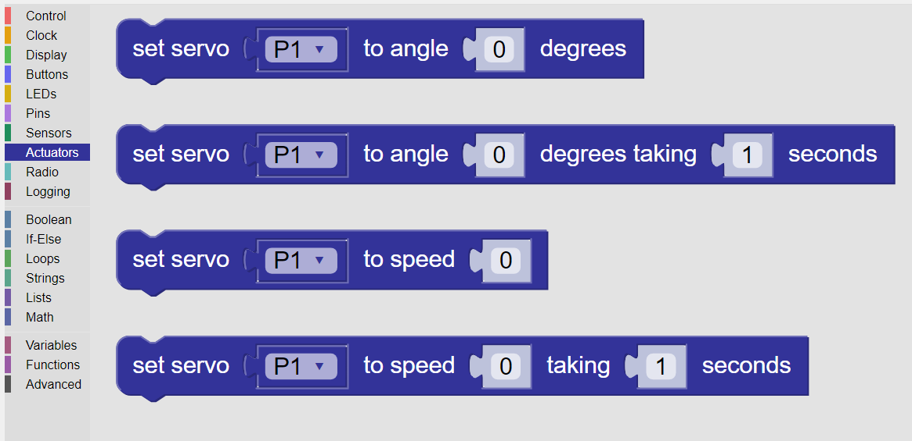

---------
Actuators
---------

The Actuators category provides the blocks that enable the use of these servos. See :numref:`actpalette`.

.. _actpalette:

   
   The palette of **KookaBlockly** Actuator blocks

The Actuators category comprises blocks to use Hobby Servos and Continuous Rotation Servo 
Motors. 

Hobby Servos and have a built in motor, a feedback 
circuit and a motor driver. They can be set to a particular angle and have a constrained range of motion, typically 180 degrees. 
These servos are used in robot arms, for example.

Continuous Rotation Servos, as the name implies, can rotate continuously like a motor.  
The control signal sets the speed of rotation, typically in degrees per second.
Continuous rotation servos can be used for driving the driving wheels of vehicles.

The supported servo motors have a three pin connector comprising:

a. Gnd - power supply ground
b. Vcc - positive DC power supply, and
c. A pulse servo signal that controls the servo motion.   

A typical Hobby Servo operates with a power supply voltage of around 4.5 to 6 volts.  

While it is possible to drive some small servos directly from the 
**Kookaberry**, it is recommended that the servo be powered a separate power supply due to 
the required servo power being higher than the **Kookaberry** can provide. 
A directly connected servo will be weak and slow, and may result in the **Kookaberry**'s power supply shutting down on overload.

Actuators' Pins Connections
---------------------------

Actuators are connected to the **Kookaberry** by one of the five connectors on the back, ``P1`` through to ``P5``, 
with connector ``P3`` having two possible connection points: ``P3A`` and ``P3B``. (see the :doc:`pins` category description).

Each actuator block has an input Pins drop-down selection blocks by which the input Pin can be selected. 

It is possible to replace the Pins dropdown selection block with a String block.   
This is useful when using Pins other than those exposed on the rear of the **Kookaberry**, 
or when other microprocessor boards that are compatible with **Kookaberry** firmware are being used.
In those cases type in the Pin's identifier into the String block.

Set Servo to Angle
------------------

This block is for a Hobby Servo, which is a servo is a motor that rotates over a specified angular range.  

The servo block sets the angle to which a servo motor should move specified in degrees.  The 
angle can be calculated by other value blocks or be specified as a fixed value.  The option for this 
block is which connector the servo is attached.

The block has two parameters:

1. A dropdown block to selected which Pin the servo's control signal is connected to. 
   A string block can also be used instead of the drop-down selector blocks and the name of the Pin typed into the block.

2. The angle, in degrees, to which the servo is to rotate.  The angle can be between - (range of rotation) / 2 to + (range of rotation) / 2.
   The rotation will occur almost instantly.

.. image:: images/actuators-set-servo-to-angle.png
   :height: 120
   :align: center

.. important::
  Please note that all but the smallest 9g servos should not be directly plugged into a 
  **Kookaberry** connector.  These devices require special electronics to supply them with more power.  
  Plugging in large servos without the necessary driving electronics may shut down and possibly irreparably damage the **Kookaberry**!

Set Servo to Angle Taking Seconds
---------------------------------

This block is the same as the **Set Servo to Angle** block with the addition of a parameter to set the time, in seconds,
over which the angular motion should occur.  This allows for a less abrupt and more graceful motion of the servo.

The block has three parameters:

1. A dropdown block to select which Pin the servo's control signal is connected to. 
   A string block can also be used instead of the drop-down selector block and the name of the Pin typed into the block.

2. The angle, in degrees, to which the servo is to rotate.  
3. The time, in seconds, over which the rotation will occur.

Set Servo to Speed
------------------

This block is for a Continuous Servo, which is a motor that rotates at a specified rotational speed.  

The servo block sets the angular speed at which a servo motor should rotate specified in degrees per second.  The 
speed can be calculated by other value blocks or be specified as a fixed value.  The option for this 
block is which connector the servo is attached.

The block has two parameters:

1. A dropdown block to select which Pin the servo's control signal is connected to. 
   A string block can also be used instead of the drop-down selector block and the name of the Pin typed into the block.

2. The speed at which the servo is to rotate in degrees / second.  The target speed will occur almost instantly.

.. important::
  Please note that all but the smallest 9g servos should not be directly plugged into a 
  **Kookaberry** connector.  These devices require special electronics to supply them with more power.  
  Plugging in large servos without the necessary driving electronics may shut down and possibly irreparably damage the **Kookaberry**!

Set Servo to Speed Taking Seconds
---------------------------------

This block is for a Continuous Servo, which is a motor that rotates at a specified rotational speed.  

This block is the same as the **Set Servo to Speed** block with the addition of a parameter to set the time, in seconds,
over which the change in angular speed should occur.  This allows for a less abrupt and more graceful transition in the speed of the servo.

The block has three parameters:

1. A dropdown block to select which Pin the servo's control signal is connected to. 
   A string block can also be used instead of the drop-down selector block and the name of the Pin typed into the block.

2. The speed, in degrees / second, at which the servo is to rotate.  
3. The time, in seconds, over which change to target speed will occur.

More Actuator Learning Resources
--------------------------------

More information on using actuators with the **Kookaberry** can be found here: https://learn.auststem.com.au/peripheral/micro-servo/
