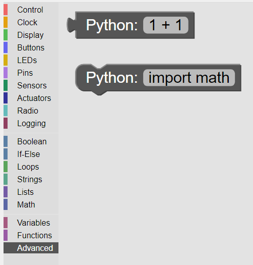
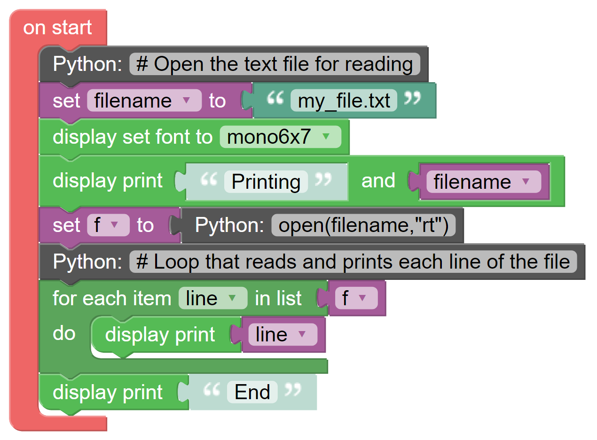

--------
Advanced
--------

The Advanced Category is provided to extend the capability of **KookaBlockly** by allowing the 
definition of additional blocks using Python programming statements.  

This category is available to the more advanced user as a way of transitioning from **KookaBlockly** to Python scripts, and 
also to add extended functionality such as using special sensors and actuators and other 
Kookaberry peripherals, or using Python module libraries.

   
   The Advanced block palette

Python Value
------------

This value block allows the result of any Python statement to be passed to **KookaBlockly** block input sockets.  

The Python statement is typed into the text box in the block.  In the default block, the statement ``1+1``
results in the output value of ``2``.

Python Action
-------------

This action block permits any Python statement to be inserted into a **KookaBlockly** script.  The 
statement is typed into the text box in the block.

Typical usage might be to import a library module, for example ``“import math”``, 
or ``“import mymodule"`` where a customised module has been developed, 
or anything else that is permitted in Python syntax.

It can also be used to insert comments into the script by prefixing the inserted text with a ``#`` character, 
designating that the following text is a comment.

Advanced Example
----------------

**KookaBlockly** does not, at this stage, provide any blocks to read a text file.  

This example reads a plain text file using the **Advanced** blocks and prints each line that is read on the display.

This script uses two **Python Action** blocks to insert in-line comments in the **KookaBlockly** and the resulting MicroPython script.

Three variables need to be created:

1. ``filename`` which is set to a string containing the files' name ``"my_file.txt"``
2. ``f`` which is used to store a list of lines coming from the text file
3. ``line`` which temporarily stores each line from the file as they are read in the loop.

Only one **Python Value** block is needed that sets the variable ``f`` to a list of lines created by opening the text file using a Python statement.

The MicroPython code that the **KookaBlockly** script generates is shown below.

.. code:: Python

    import machine, kooka
    import fonts

    filename = None
    f = None
    line = None
  
    # On-start code, run once at start-up.
    if True:
      # Open the text file for reading
      filename = 'my_file.txt'
      kooka.display.setfont(fonts.mono6x7)
      kooka.display.print('Printing', filename, show=0)
      f = open(filename,'rt')
       # Loop that reads and prints each line of the file
      for line in f:
        kooka.display.print(line, show=0)
      kooka.display.print('End', show=0)
  
    # Main loop code, run continuously.
    while True:
      kooka.display.show()
      machine.idle()

To run the above script, a text file called ``my_file.txt`` should be stored on the Kookaberry's file system in its root folder.
The file contains the following:

.. code::

  This is line 1
  Line 2
  This is line 3
  Line 4
  The last line

When the script is run, the appearance of the Kookaberry display is as below:

