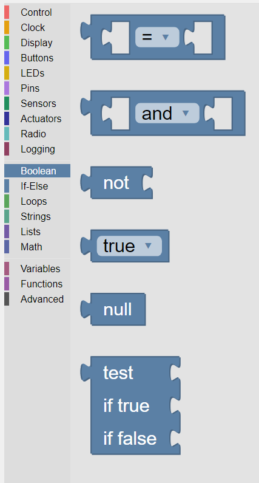

-------
Boolean
-------

Boolean blocks are value blocks used to test whether a specified condition is ``True`` (1) or ``False`` (0).

 

   
   The palette of KookaBlockly Boolean blocks

Comparison
----------

This Comparison block compares the two value blocks that are given with the rule selected from the dropdown menu 
and outputs a result of ``True`` or ``False``.  
The options available in the drop-down selection box are:

1. the inputs are equal (=)
2. the inputs are not equal (≠)
3. the first input is less than (<) the second input
4. the first input is less than or equal to (≤) the second input
5. the first inputs is greater than (>) the second input
6. the first input is greater than or equal to (≥) the second input.

Equal to (=) and not equal to (≠) work for almost anything including numbers, lists (arrays) and character strings.

The other operands only work for numbers.

Boolean And / Or
----------------

The Boolean And / Or block performs the selected Boolean operation on its two inputs. 

Both inputs are required to be Boolean.  It is not possible to plug numbers or text strings into the inputs.

*  ``and`` will give back a ``True`` only if both of its inputs are ``True``.  
*  ``or`` will give back ``True`` if either or both of its inputs are ``True``.

Not
---

This block takes a ``True``/``False`` Boolean value block input and logically inverts it.  

That is, ``True`` becomes ``False``, and ``False`` become ``True``.

True / False
------------

This value block gives a Boolean ``True`` or ``False`` value depending on which option is selected.  
It is generally used to initialise variables that are subsequently used in a program.

Null
----

This value block is the value that variables have before they are given a value.  It is a special 
value that represents “none” or “nothing” but is distinct from 0.  However it is treated as a zero 
or ``False`` value if used.

Test If
-------

This block will output one of two input values depending on whether the **test** input is ``True`` or ``False``. 

If the block in the **Test** input socket is ``True``, the value in the **if true** input is transferred to the output.

If the block in the **Test** input socket is ``False``, the value in the **if false** input is transferred to the output.

