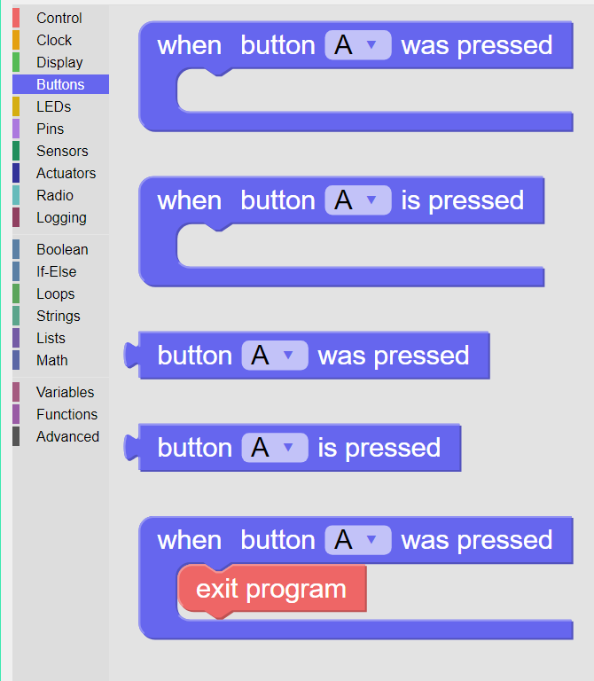

-------
Buttons
-------

Button blocks are used to specify the actions to be taken when a specific button is pressed. See :numref:`btnpalette`.

.. _btnpalette:

   
   The palette of **KookaBlockly** **Buttons** blocks

The **Kookaberry** has four buttons beneath the display labelled A, B, C and D.  

These buttons are coloured ``A`` red, ``B`` green, ``C`` blue, and ``D`` yellow.  

.. _kookaphoto:

   
   **Kookaberry** - front view showing **Display**, **LEDs** and **Buttons**

Button functions are also available on the virtual **Kookaberry** which is shown when **KookaBlockly**'s **Show display** button is clicked.

.. _virtkookaphoto:
.. figure:: images/kberry-virtual-blank.png
   :width: 300
   :align: center
   
   Virtual **Kookaberry**

Each block in the **Buttons** category is described in turn below.

When Button Was Pressed
-----------------------

This is a control loop that performs the actions contained within it whenever the selected 
button *was pressed*. 

The button options are ``A``, ``B``, ``C``, or ``D``.  

*was pressed* means that the actions within the loop will be performed only once after the selected button press.

When Button Is Pressed
----------------------

This is a control loop that performs the actions contained within it as long as the selected 
button *is pressed*. 

The button options are ``A``, ``B``, ``C``, or ``D``.  

*is pressed* means that the actions will be performed repeatedly as long as the selected button is being pressed.

Button was pressed
------------------

This is a value block whose result is ``True`` (= ``1``) whenever the selected button was pressed.  

The button options are ``A``, ``B``, ``C``, or ``D``.

After this value block is used its output reverts to ``False`` (= ``0``) until the next time the button was pressed.

Button is pressed
-----------------	
This is a value block whose result is ``True`` (= ``1``) as long as the selected button is being pressed.  

The button options are ``A``, ``B``, ``C``, or ``D``.

Th output of this value block reverts to ``False`` (= ``0``) when the button is not being pressed.

Button to Exit Program
----------------------

This is a combination of two blocks: the **button was pressed** control loop, as described above, and the **exit program** action.

.. image:: images/buttons-when-was-pressed-exit.png
   :scale: 50%
   :align: center
   :alt: Exit When Button Was Pressed Block

The result of using this combination is whenever the button selected was pressed the currently running program will finish.

