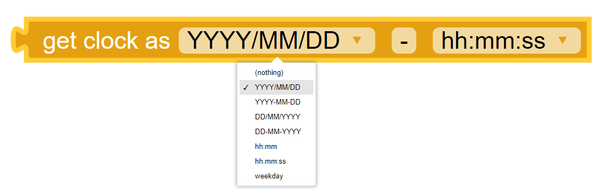
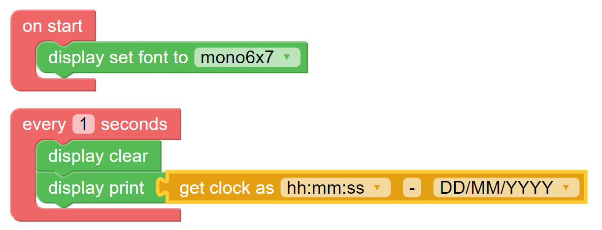
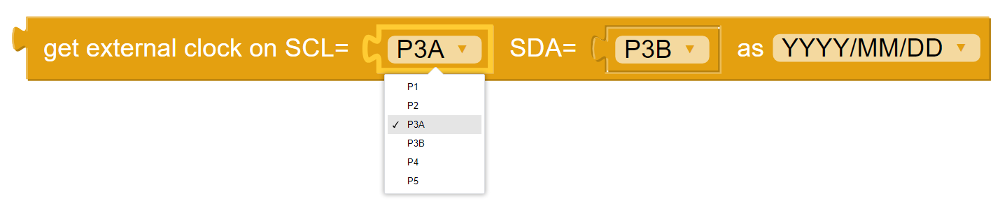
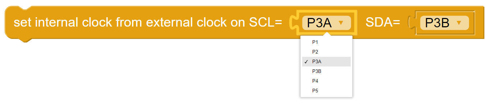
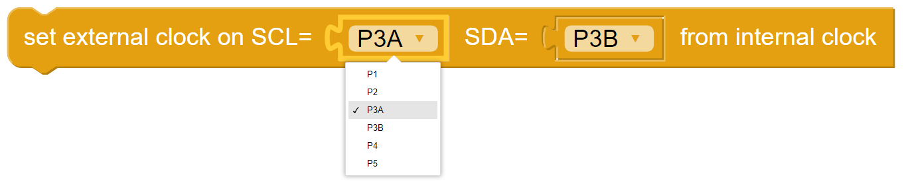

Clock
=====

The blocks in the Clock category provide the functions to read and set the electronic real-time-clocks (RTCs).  

The Kookaberry has an internal RTC which defaults to a time of 00:00:00 on 1 January 2015 when the Kookaberry is turned on.  

The Kookaberry does not retain the time without external power as it has no internal battery to keep the internal clock running.

When the Kookaberry is connected to KookaBlockly, its internal RTC is updated to the time on the hosting computer.

An external RTC, connected as an accessory to the Kookaberry, usually has a battery and therefore maintains the time that has been previously set on it.  
This provides a convenient way for the Kookaberry to obtain the correct time when it is not tethered to KookaBlockly (or KookaIDE or KookaTW).  
The external RTC is connected to the Kookaberry using two Pins specified as SCK and SDA on the relevant blocks.

Clicking on the Clock category in the KookaSuite palette reveals the available blocks, as below.  
Click and drag any of the required blocks to the KookaBlockly workspace and connect with other blocks to build a script that can use and/or set the time.

.. figure:: images/clock-palette.png
   :width: 500
   :align: center
   
   The palette of KookaBlockly Clock blocks.

Each of the Clock blocks is described in the following sections.

--------------
Internal Clock
--------------

Get Clock – Simple Time
-----------------------

Reads the Kookaberry’s internal Real Time Clock (RTC) and returns a date or time in the chosen format selected from the drop-down menu on the block.  

The value returned is a character string.

.. image:: images/get-clock-simple.png
   :width: 250
   :align: center

Get Clock - Extended Time
-------------------------

Reads the Kookaberry’s internal Real Time Clock (RTC) and returns the date and time as a character string comprising two parts 
per the selected formats and separated by a string of characters that can be specified by the user (the default separator is the minus character ``-``).

Below is a KookaBlockly example script demonstrating a loop which updates the Kookaberry’s display every second with the current time and date.

   
   A KookaBlockly Script that shows the current time and date on the Kookaberry display.

.. figure:: images/get-clock-extended-display.png
   :width: 200
   :align: center
   
   The Kookaberry display resulting from the example KookaBlockly Script.

 
--------------
External Clock
--------------

Get External Clock - Simple Time
--------------------------------

Reads the Kookaberry’s external Real Time Clock (RTC) and returns a date or time in the chosen format selected from the drop-down menu on the block.  

The value returned is a character string.

The external RTC is connected to the Kookaberry's connector ports as selected from the SCK and SDA dropdown lists. 
The default setting of SCL as ``P3A`` and SDA as ``P3B`` is usually correct, meaning the external RTC is connected to the Kookaberry using the 4-pin P3 port.

Get External Clock – Extended Time
----------------------------------

Reads the Kookaberry’s external Real Time Clock (RTC) and returns the date and time as a character string comprising two parts 
per the selected formats and separated by a string of characters that can be specified by the user (the default separator is the minus character ``-``).

The external RTC is connected to the Kookaberry's connector ports as selected from the SCK and SDA dropdown lists. 
The default setting of SCL as ``P3A`` and SDA as ``P3B`` is usually correct, meaning the external RTC is connected to the Kookaberry using the 4-pin P3 port.

.. image:: images/get-external-clock-extended.png
   :width: 500
   :align: center

Set Internal Clock from External Clock
--------------------------------------

Sets the Kookaberry’s internal Real Time Clock (RTC) by copying the current time from the external RTC.

The external RTC is connected to the Kookaberry's connector ports as selected from the SCK and SDA dropdown lists. 
The default setting of SCL as ``P3A`` and SDA as ``P3B`` is usually correct, meaning the external RTC is connected to the Kookaberry using the 4-pin P3 port.

Set External Clock from Internal Clock
--------------------------------------

Sets the Kookaberry’s external Real Time Clock (RTC) by copying the current time from the internal RTC. 

This is useful for updating the external RTC with the correct time when the Kookaberry is tethered to KookaBlockly.

The external RTC is connected to the Kookaberry's connector ports as selected from the SCK and SDA dropdown lists. 
The default setting of SCL as ``P3A`` and SDA as ``P3B`` is usually correct, meaning the external RTC is connected to the Kookaberry using the 4-pin P3 port.

Set External Clock from Character String
----------------------------------------

Sets the Kookaberry’s external Real Time Clock (RTC) to the time specified by a character string in the format "YYYY/MM/YY HH:MM:SS". 

This is useful for updating the external RTC with a fixed time or where the Kookaberry internal clock has not been 
automatically synchronised using KookaBlockly.

The external RTC is connected to the Kookaberry's connector ports as selected from the SCK and SDA dropdown lists. 
The default setting of SCL as ``P3A`` and SDA as ``P3B`` is usually correct, meaning the external RTC is connected to the Kookaberry using the 4-pin P3 port.

.. image:: images/set-external-clock-from-string.png
   :width: 500
   :align: center

