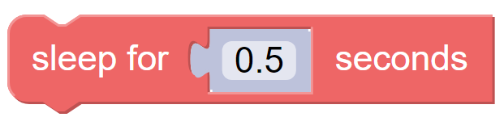
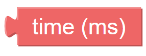

-------
Control
-------

The **Control** blocks in :numref:`contpalette` direct program flow or provide time-related functionality.

.. _contpalette:

   
   The palette of **KookaBlockly** **Control** blocks

Each block is described in turn below.

On Start
--------

The "on start" block is intended to contain other action blocks that will run first and only once when the **KookaBlockly** script starts.

Typically the blocks contained are for the initialisation of the display, variables, sensors, and actuators.

Scheduled Loop
--------------

This block is a loop that repeatedly runs the blocks nested inside at the time interval specified in the numeric box. 

.. image:: images/scheduled-loop.png
   :scale: 50%
   :align: center
   :alt: Timed Loop Block

The loop will continue forever at the defined period unless the program is externally stopped.

The time specification is a number in decimal seconds, for example: 1 is 1 second, and 0.001 is 1 millisecond.

Every Loop
----------

This block runs the blocks nested inside in a repeated loop.  

.. image:: images/every-loop.png
   :scale: 50%
   :align: center
   :alt: Every Loop Block

The loop will run forever unless externally stopped by exiting the script, or resetting the **Kookaberry** or removing power from the **Kookaberry**.  

Another name for this block is the Repeat Forever loop.

Exit Program
------------

This block directs the running program to exit.

Sleep
-----
 
This block causes the program to wait / pause for the specified time before continuing to the next block.  

The number in the box specifies the duration of sleep in decimal seconds.

Time (s)
--------

This block returns a value in whole seconds since the **Kookaberry’s** epoch time ( 00:00:00 on 1st 
January 2000).  

.. image:: images/time-secs.png
   :scale: 50%
   :align: center
   :alt: Time Seconds Value Block

By subtracting successive values given by this block, the elapsed interval in 
seconds between the samples may be calculated which is useful for timing functions.

.. note:: 

   **epoch time** is the point from which time is measured.  This point differs for different operating systems.  
   For MicroPython on micro-computers, the **epoch time** is 2000-01-01 00:00:00.

   **epoch time** should not be confused with the **default time** set on the **Kookaberry**'s internal Real Time Clock (**RTC**), which is 2015-01-01 00:00:00.
   Using **KookaBlockly**, however, the **Kookaberry**'s internal **RTC** will be synchronised with the time on the PC it is tethered to using its USB connection.

Time (ms)
---------

This block returns a value in milliseconds since the **Kookaberry’s** epoch time (00:00:00 on 1st 
January 2000).  

By subtracting successive values given by this block, the elapsed interval in 
milliseconds between the samples may be calculated which is useful for high-resolution timing functions.
