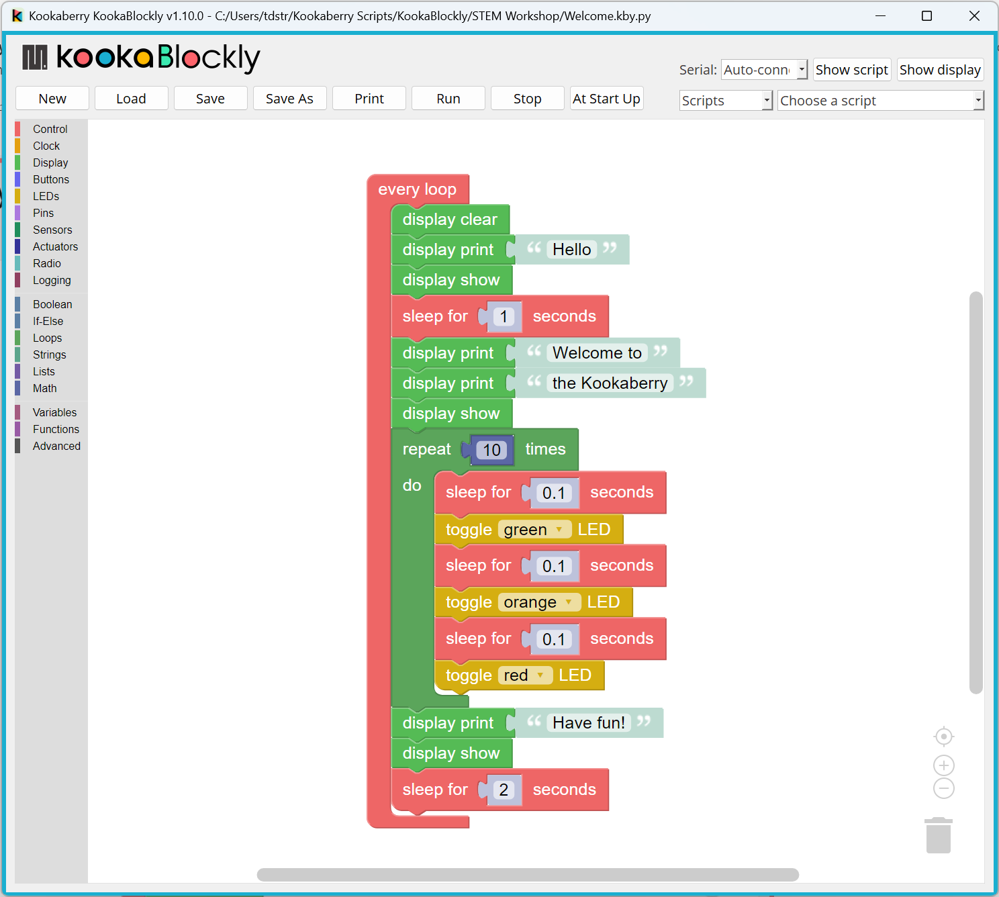
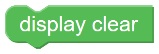
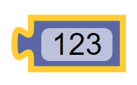
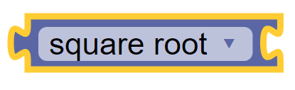

============================
KookaBlockly Reference Guide
============================

A KookaBlockly script is assembled from graphical function blocks dragged onto the workspace from the palette of blocks on the left of the display.  The blocks click together like pieces of a jigsaw puzzle to form a series of steps that the Kookaberry microcomputer will perform.

   This is the KookaBlockly display with an example KookaBlockly script. 

The example shown above shows a loop that writes a welcome message on the Kookaberry display and flashes the Kookaberry's LEDs.  It then sleeps for 2 seconds and then goes back to the beginning of the loop.  The loop will run until the Kookaberry is reset or power is removed.

This reference guide provides a reference for each of the Blocks in the 18 multi coloured KookaBlockly categories.
 

KookaBlockly Conventions
========================

KookaBlockly provides an extensive palette of blocks to assemble into scripts.  The block palette is on the left of the display organised into functionally related categories.  

Clicking on a category, for example the Control category, reveals the blocks available within that category.  To use the block, click on it and drag it onto the KookaBlockly workspace and release, and/or drag it into position until it snaps onto an adjacent block.

KookaBlockly contains three basic block shapes:

1.	A C-shaped block directs program flow and contains a sequence of action blocks.  The C-shaped block may be a loop, or may be a sequence of blocks that are run conditionally subject to one or more logical tests.

.. image:: images/every-loop.png
   :width: 150
   :align: left

.. image:: images/if-do.png
   :width: 150
   :align: right

2.	An action or “do” block which performs an operation.  The block has an indent in the top border and a matching protrusion on the bottom border.  These blocks click together like jigsaw pieces and may be placed in a vertical column and within a C-shaped block.

3.	A value block which has a jigsaw tab on the left-hand edge.  These blocks evaluate an expression and assign an output value to the blocks to which they are connected.  Some value blocks have a matching receptacle on the right-hand edge which accepts other value blocks.

Some blocks have configuration options denoted by a cog symbol.  Clicking on the cog symbol presents options that may be used to configure the block.

.. image:: images/if-do-config.png
   :width: 150
   :align: center

Right-clicking on a block also presents a set of option as below.  These include: duplicate the current block; add a comment; collapse the block into a compact presentation or expand a collapsed block; disable or enable a block; remove the block from the program; or display some Help text about the block (if the Help text has been provided).

.. image:: images/if-do-rightclick.png
   :width: 150
   :align: center

Deleted blocks are placed in the Trash whose symbol is on the bottom right of the workspace.  Clicking on the Trash icon opens the lid and displays the deleted items.  Any deleted item may be dragged back into the workspace to become part of the program.  Clicking on a blank area of the workspace closes the Trash.
