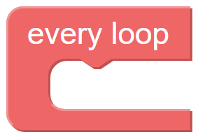
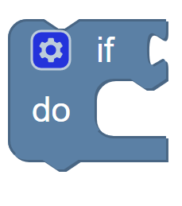

KOOKABLOCKLY REFERENCE GUIDE
============================

This reference guide provides a reference for each of the Blocks in the 18 multi coloured KookaBlockly categories.
.. image:: images/kblockly-canvas.png
   :width: 500
   :alt: KookaBlockly Canvas

KookaBlockly Conventions
------------------------

KookaBlockly contains three basic block shapes:

1.	A C-shaped block directs program flow and contains a sequence of action blocks.  The C-shaped block may be a loop, or may be a sequence of blocks that are run conditionally subject to one or more logical tests.

2.	An action or “do” block which performs an operation.  The block has an indent in the top border and a matching protrusion on the bottom border.  These blocks click together like jigsaw pieces and may be placed in a vertical column and within a C-shaped block.

3.	A value block which has a jigsaw tab on the left-hand edge.  These blocks evaluate an expression and assign an output value to the blocks to which they are connected.  Some value blocks have a matching receptacle on the right-hand edge which accepts other value blocks.

Some blocks have configuration options denoted by a cog symbol.  Clicking on the cog   symbol presents options that may be used to configure the block.

Right-clicking on a block also presents a set of option as below.  These include: duplicate the current block; add a comment; collapse the block into a compact presentation or expand a collapsed block; disable or enable a block; remove the block from the program; or display some Help text about the block (if the Help text has been provided).

Deleted blocks are placed in the Trash whose symbol is on the bottom right of the workspace.  Clicking on the Trash icon opens the lid and displays the deleted items.  Any deleted item may be dragged back into the workspace to become part of the program.  Clicking on a blank area of the workspace closes the Trash.
