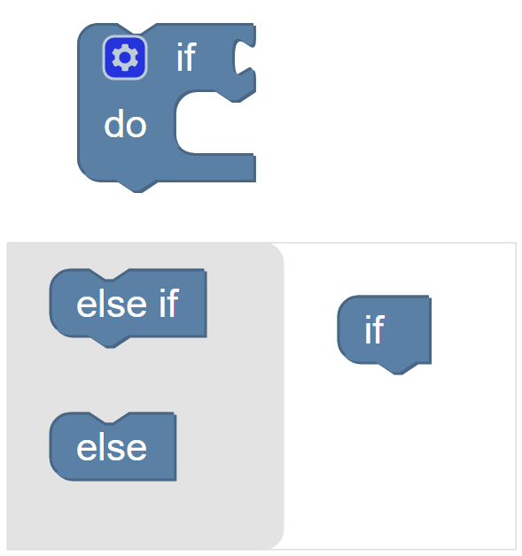
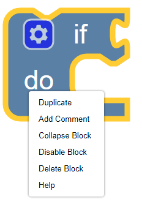

KookaBlockly Conventions
========================

KookaBlockly provides an extensive palette of blocks to assemble into scripts.  The block palette is on the left of the display organised into functionally related categories.  

Clicking on a category, for example the Control category, reveals the blocks available within that category.  To use the block, click on it and drag it onto the KookaBlockly workspace and release, and/or drag it into position until it snaps onto an adjacent block. Any block in the workspace can be clicked on and dragged into position.

KookaBlockly contains three basic block shapes:

1.	A C-shaped block directs program flow and contains a sequence of action blocks.  The C-shaped block may be a loop, or may be a sequence of blocks that are run conditionally subject to one or more logical tests.

2.	An action or “do” block which performs an operation.  The block has an indent in the top border and a matching protrusion on the bottom border.  These blocks click together like jigsaw pieces and may be placed in a vertical column and within a C-shaped block.

.. image:: images/display-clear.png
   :width: 200
   :align: center

3.	A value block which has a jigsaw tab on the left-hand edge.  These blocks evaluate an expression and assign an output value to the blocks to which they are connected.  Some value blocks have a matching receptacle on the right-hand edge which accepts other value blocks.

Some blocks have configuration options denoted by a cog symbol.  Clicking on the cog symbol presents options that may be used to configure the block.

Right-clicking on a block also presents a set of option as below.  These include: duplicate the current block; add a comment; collapse the block into a compact presentation or expand a collapsed block; disable or enable a block; remove the block from the program; or display some Help text about the block (if the Help text has been provided).

Duplicate		
   Click on Duplicate to create a duplicate of the block and any connected sub-blocks in the workspace.  Sub-blocks for example are all the blocks nested within a control block, or any value blocks connected to an action block.

Add Comment	
	Click on Add Comment and a circle with a question mark will appear in the block.                               
   Click on the question mark and an area pane is provided for a user to enter in a comment.  
   This comment will be included in the MicroPython script generated by KookaBlockly.                               
   Comments are very useful for describing parts or portions of the script for later reference by subsequent users of the script.

Collapse Block		
   Click on Collapse Block to truncate the block.  
   This is useful when a large number of blocks are in the workspace and the user wants to make a block smaller so that it is easier to see other blocks.  
   The user can restore the collapsed block at any time.

Disable Block		
   Click on Disable Block to make the block turn white and it will not be included in the script.  
   This is similar to “commenting out” lines of scripts when writing MicroPython code.

Delete Block		
   Choose a block by clicking on it.  
   Right click on the block and then choose Delete Block to delete the block from the script or press the Delete key on the keyboard.   
   Blocks can also be deleted by clicking on a block, separating it from the graphical script and dragging it into the Trash.
   Clicking on the Trash icon, which is at the bottom-right of the Workspace, opens the lid and displays the deleted items.  
   Any deleted item may be dragged back into the workspace to become part of the program.  
   Clicking on a blank area of the workspace closes the Trash.
