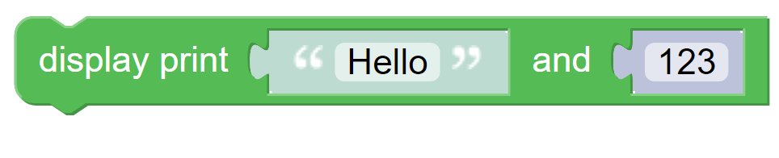
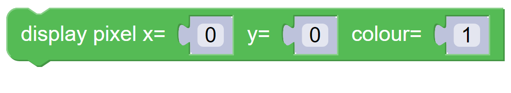
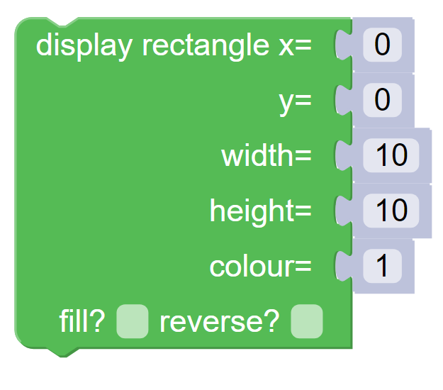

-------
Display
-------

**Display** blocks in :numref:`dispalette` control what appears on the **Kookaberry**'s display.

.. _dispalette:
.. figure:: images/display-palette.png
   :scale: 50%
   :align: center
   
   The palette of **KookaBlockly** **Display** blocks

Each block is described in turn below.

Kookaberry Display
------------------

The **Kookaberry’s** display is a 128 pixel wide x 64 pixel high cyan OLED (Organic Light Emitting Diode) display.  

.. _discoords:

   
   The **Display** coordinates

The x direction is the width of the display having a range specified as 0 to 127 pixels and the y direction 
is the height of the display having a range specified as 0 to 63 pixels.  

As shown in :numref:`discoords`, the (x,y) location (0,0) is at the top left-hand corner of the display.  
The bottom right of the display has a location reference (x,y) of (127,63).

The display is driven from an internal memory array known as a Framebuffer, 
into which the software writes the pixel data prior to its contents being transferred to the physical **Kookaberry** display.  
This reduces any display flicker.  

The method of writing to a display is generally:

1.	**Clear** the Framebuffer
2.	Write text and/or graphics to the Framebuffer in one or more parts to build up the entirety of the **Display**'s contents, and then
3. **Show** the display buffer on the display.

The following blocks provide the functionality to operate the **Kookaberry**'s **Display**.

Text coordinates
----------------

The coordinates at which text is positioned on the **Display** differs from the graphical elements (``pixel``, ``line``, ``rectangle``, and ``image``).

*  Graphical elements are positioned at their top-left corner.
*  Text is positioned at its bottom-left corner.

To accurately position text, one can use trial-and-error, or make a calculation that depends on the text font size (the default being ``mono8x8``).

* To position a pixel at the top-left of the **Display** (0,0) simply specify x=0 and y=0 in the **Display Pixel** block.
* To position text at the top-left of the **Display**, specify (0,7) being x=0 and y=7 (the mono8x8 font height) in the **Display Print** block.

Display Clear
-------------
 
This block clears the display’s frame buffer.  The physical display will not be updated until a **Display Show** is used.

.. image:: images/display-clear.png
   :scale: 50%
   :align: center
   

Display Show
------------
 
This block transfers the display’s frame buffer to the **Kookaberry’s** physical display.  

**KookaBlockly** automatically inserts the equivalent **Display Show** code towards the end of the generated MicroPython script.
However it may be desirable to refresh the physical display earlier in the **KookaBlockly** script, 
such as at the end of a loop that updates the display.  
Use this **Display Show** block in such circumstances as otherwise the display will not update until the end of the script.

Display Set Font
----------------
 
This block sets the character font to that selected from the drop down box.  

.. image:: images/display-setfont.png
   :scale: 50%
   :align: center
   

The display fonts available for selection are from smallest to largest: 

* ``mono5x5`` - each text character is 5  pixels wide by 5 pixels tall

* ``mono6x7``,- 6 pixels wide by 7 pixels tall

* ``mono6x8`` - 6 pixels wide by 8 pixels tall

* ``mono8x8`` - 8 pixels wide by 8 pixels tall (the default font)

* ``mono8x13`` - 8 pixels wide by 13 pixels tall, and 

* ``sans12``.- 12 pixels wide by 12 pixels tall

The selected font will be applied from the point of selection.

A display using several fonts sizes may be constructed by using the **Display Set Font** block 
as the display Framebuffer is constructed by the **KookaBlockly** script.

Display Print
-------------
 
This block prints the editable text in the input value block to the **Kookaberry** display at position x=0 on a new line.  
The current line is set to the top of the screen immediately after the display is cleared. 

.. image:: images/display-print.png
   :scale: 50%
   :align: center
   

If the line is longer than the display’s width, the line is wrapped onto successive lines of the display. 
The current display line is increased by each successive **Display Print** until the bottom of the display is reached.  

Thereafter each successive **Display Print** will scroll the display upwards by one line and the current line is shown at the bottom of the display.

Display Print-and
-----------------
 
This block displays the editable text or value in the attached input value block on the current line of the display, 
followed by the output of any value block.

   

:numref:`disprtandexample` shows an example to display the time:

.. _disprtandexample:
.. figure:: images/display-print-and-example.png
   :scale: 50%
   :align: center
   
   **Display Print-and** example script

This example results in a display that looks like :numref:`disprtoutput` and is updated every second. 

.. _disprtoutput:
.. figure:: images/display-print-and-tw.png
   :height: 200
   :align: center
   
   **Display Print-and** example display

By using “Display Clear” the displayed text stays at the top of the screen instead of scrolling down the display.

Display Pixel
-------------
 
This block displays a pixel at the x and y locations with the specified colour on the display.  The 
values of x, y and colour are the outputs of any value block.  

   

If the values of x or y are outside of the display dimensions then the pixel will not be visible.  

The values for colour should be either 0 or 1, where 0 is pixel off (black) and 1 is pixel on (cyan).

Display Line
------------

This block draws a line on the display starting from the location given by the values x1, y1 to the 
location given by the values x2,y2.  

.. image:: images/display-line.png
   :scale: 50%
   :align: center

The value for colour should be either ``0`` or ``1``, where ``0`` is pixel off (black) and ``1`` is pixel on (cyan).

Display Rectangle
-----------------

This block displays a rectangle starting at location given by the values  x, y  with a width and 
height given by the results of the value blocks attached to those parameters.

The value for colour should be either ``0`` or ``1``, where ``0`` is pixel off (black) and ``1`` is pixel on (cyan).

The **fill?** box when ticked fills the rectangle with pixels of the given colour.

The **reverse?** box specifies the orientation of the rectangle with respect to the x and y coordinates:

* if **reverse?** is not ticked, x and y specify the location of the top-left of the rectangle
* if **reverse?** is ticked, x and y specify the location of the bottom-right of the rectangle.

The example script in ::numref:`disprectexample` displays two rectangles of equal origin and dimensions, 
with one of them having the **reverse?** box ticked.  The resulting display in :numref:`disprectexampledisp`shows two rectangles,
in normal and reverse orientations about the same x and y origin.

.. _disprectexample:

   Example showing the effect of the **reverse?** box on the **Display Rectangle** block

.. _disprectexampledisp:

   The resulting display showing the effect of the **reverse?** box on the **Display Rectangle** block

Display Text
------------

This block enables the display of the attached output of the attached value block (ie “Hello”) at 
the location specified by the value blocks at x and y on the display, with the colour being the 
value block output of 0 or 1.

.. image:: images/display-text.png
   :scale: 50%
   :align: center
   

.. note::    The (x, y) coordinate is where the bottom left corner of the display text is positioned.

Display Image
-------------

This block allows for the creation of an 8 x 8 pixel array positioned on the **Kookaberry** display at the coordinates of x and y.

.. image:: images/display-image.png
   :scale: 50%
   :align: center
   

The **transparent?** box if ticked will not extinguish any pixels that were already on, thereby giving an 
impression of transparency.

By manipulating the values of x and y using value blocks, the pixel array can be made to move 
around the screen.  

Larger pixel arrays can be created by using multiple **Display Image** blocks with adjacent coordinates (by incrementing x and y in multiples of 8).
