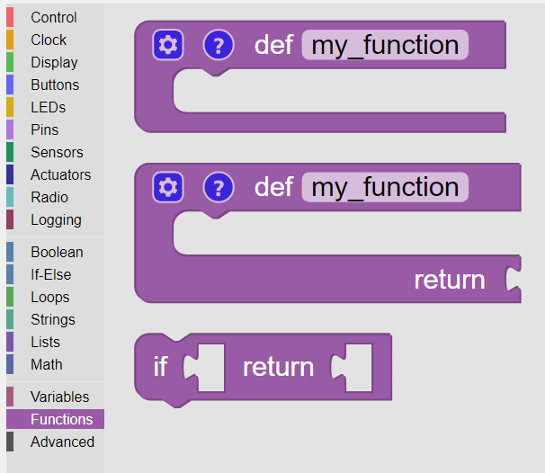

---------
Functions
---------

**Functions** are blocks that contain a sequence of other blocks.  

Once defined, functions are available on the **Functions** palette for use in the **KookaBlockly** script in which they are defined.
See :numref:`funcpalette`.

.. _funcpalette:

   
   The initial **Functions** palette

Function blocks can be used repeatedly in a script without needing to repeat all the blocks they contain.
This simplifies scripts and saves valuable computer memory space.

.. important:: 

    The function definition must remain in the **KookaBlockly** workspace for it to remain available in the **Functions** palette.
    Deleting the function definition will remove the function block from the palette and all instances of it from the script.

Define Function
---------------

This block allows a user to define a sequence of blocks that will be run together when 
the function’s block is used.  

To define a function, drag this block into the **KookaBlockly** workspace.

The block has a gear wheel which when clicked causes the definition box to appear:

Once the definition of the function block is complete, click on the cog symbol once again to close the definition box.  
Remember to leave the function definition block in the **KookaBlockly** workspace!

The function block will then be available in the palette for use elsewhere in the script:

Define Inputs
~~~~~~~~~~~~~

A function may, or may not, have inputs that will be used by the script inside the function.  

To define the inputs, drag the input block on the left of the box into the bracket on the right.

To remove an input, drag the input block out of the bracket back to the grey box on the left.

Rename the inputs as desired by editing their names (click on the name and type the new name).  
It is best to give the inputs names that are meaningful so the **KookaBlockly** script can be more easily understood by humans.

All the inputs will become :doc:`variables`, do take care not to duplicate their names!

Function Name
~~~~~~~~~~~~~

**Functions** must have unique names within the context of the **KookaBlockly** script they are in.

To define the function name, click on its name and edit the text.

Function Description
~~~~~~~~~~~~~~~~~~~~

**Functions** can optionally be described.  
A description may say what the function does, what its inputs are, what computations it performs, and what its output is.

Click on the question mark, **?**, and a description box will appear.  Type the description in the box.

To close the description box, click on the question mark.

To view the description, click on the question mark and click again to close the description.

Define Function with Return Value
---------------------------------

This block works in a similar manner to the **Define Function** block except that this block 
returns a value.  

The value returned is the output of the value block socketed at the bottom of the **Define Function with Return Value** block.  

Here is an example where a function is defined to calculate the circumference of a circle given a radius:

Once the definition of the function block is complete, click on the cog symbol once again to close the definition box.  
Remember to leave the function definition block in the **KookaBlockly** workspace!

The function block will then be available in the palette for use elsewhere in the script:

If Condition Return
-------------------

This block can be used in both the **Function Definition** and **Function Definition With Return Value** blocks.  

It will check the True / False condition in the first value block input and if it is ``True`` it will 
end the function immediately, returning the value in the second input . 

If used inside a Function Definition block (without a return value) the returned value input  will not be available.  
Instead the block will just end the function if the input condition is ``True``.

This block cannot be used outside of the **Function Definition** blocks.  If this is attempted the block will be blanked out.

The following is an example of the use of the **If Condition Return** block with a function named ``direction``.

The function tests the sign of the acceleration read from the Z axis of the internal accelerometer.  
If Z acceleration is negative then the tested condition is ``True`` which means the **Kookaberry** is facing up, and the string ``"up"`` is returned.
Otherwise, that is the condition is ``False``, which means the **Kookaberry** is tilted face-down. The function completes and returns the string ``"down"``.

The main script is a loop which repeats every second and prints the value of the function on the display.  
The display will change as the **Kookaberry** is oriented face-up or face-down.

