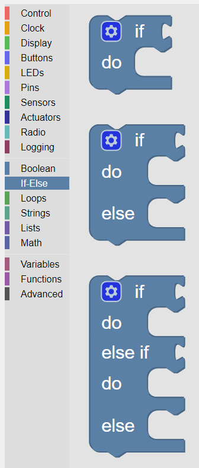

-------
If–Else
-------

The **If-Else** category comprises control blocks which direct the flow of a program depending on the results of the tests carried out by these blocks.
See :numref:`ifpalette`.

.. _ifpalette:

   
   The palette of **KookaBlockly** **If-Else** blocks

If-Do
-----

The **if** input socket takes a value block or compound block that represents a ``True`` or ``False`` value.  
If the value block in the conditional socket is ``True``, it runs the blocks nested inside.  
If the block in the conditional socket is False, it skips the nested blocks.

.. image:: images/if-do.png
   :width: 120
   :align: center

If-Do-Else-Do
-------------

This block is an extension of the **If-Else-Do** block.
It adds the **else** bracket into which the action blocks that are to be run if the tested input is ``False``.
 

If-Do-Else If-Do-Else-Do
------------------------

This block is a further extension of the **If-Do-Else-Do** block.
A second conditional **else if** input is inserted and a bracket for actions to be run if the **else if** input is ``True``.

If-Do Configuration
-------------------

The **If-Do** block is configurable.   
By clicking the gear icon on the block, extra elections can be added by dragging the **else if** or **else** blocks 
into the white area to connect under the **if** block in the configuration box:

* **else if** sections can add more conditional sockets to check for further input **Boolean** values,
  and a **do** bracket to contain action blocks to be run if the input is ``True``. 
  Multiple  **else if** sections can be configured.
* a single **else** section can be added to the end to contain the action blocks to be run if none of the previous conditions are ``True``.

.. image:: images/if-do-config.png
   :width: 200
   :align: center

To remove any of the **else if** or **else** sections, drag them back into the grey area of the configuration box.

To close the configuration box, simply click the gear icon once more.

