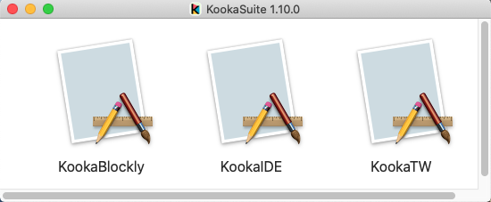
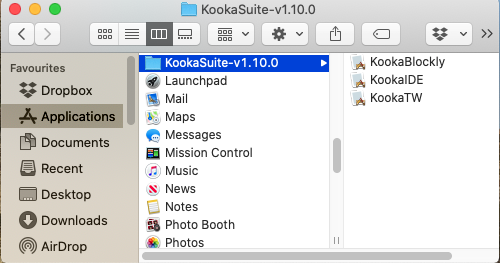

Installing KookaBlockly
=======================

**KookaBlockly** is part of the **KookaSuite** set of code development and editing tools for the Kookaberry microcomputer 
and other microcomputer boards that can use the Kooka firmware.

The tools that are in **KookaSuite** are:

KookaBlockly
  a powerful standalone visual editor designed for creating program scripts.

KookaIDE
  a text editor for creating and editing MicroPython program scripts and directly interacting with the Kookaberry control console.

  *IDE is short for Integrated Development Environment.*

KookaTW
  A virtual Kookaberry user interface that replicates the physical user interface on a Kookaberry and provides 
  a user interface for compatible microprocessor boards that do not have a physical user interface.

  *TW originated as Teacher's Window, but also stands for TWin, or in some cases Training Window.*

Downloading KookaSuite
----------------------

The latest version of **KookaBlockly** can be conveniently downloaded from the Kookaberry **GitHub** 
repository at https://github.com/kookaberry/kooka-releases/releases.

Choose the latest version compatible with your personal computer.  **KookaSuite** versions available are for:

* Microsoft Windows V10 and later

* Apple MacOS V10.15 and later

* Raspberry Pi OS (Debian v12 [bookworm])

Click on the hyperlink for the appropriate version of **KookaSuite** and download it to a folder (default is in the **Downloads** folder) on your personal computer.

Installing KookaSuite on Microsoft Windows
------------------------------------------

1.  Double-click on the downloaded ``KookaSuite-<version>-Win64.msi`` file to launch the Windows Installer.  
    The display in :numref:`wininstall1` will then appear.

.. _wininstall1:
.. figure:: images/win-install-1.png
   :width: 400
   :align: center

   Click on **Next** to proceed.

1.  **KookaSuite** does not (as yet) have an application trust certificate, so Windows Defender will alert you 
    with the dialogues in :numref:`winprot1` and :numref:`winprot2`.

.. _winprot1:

   Click on **More info** to proceed to the next dialogue.

.. _winprot2:
.. figure:: images/windows-protect2.png
   :width: 400
   :align: center

   Click on **Run Anyway** to proceed.

1. The installer will then show the **Kookaberry Licence Agreement**.  The agreement contains a liability disclaimer, 
   then a series of open-source licences for the software that is embedded within **KookaSuite**.

   To obtain a printed copy of the licence, press **Print**.

   Please read the licence conditions and if you accept them, click on the acceptance checkbox to place a tick (as shown in :numref:`wininstall2`) and then click on **Next**.

.. _wininstall2:
.. figure:: images/win-install-2.png
   :width: 400
   :align: center

   Click the checkbox to accept the licence, then click on **Next** to proceed.

4. The dialogue in :numref:`wininstall3` will then appear showing where on your computer the **KookaSuite** programs will be installed.  

   Usually the default location of ``C:\Program Files\Kookaberry\KookaSuite`` is fine, but you or your system administrator may wish to put them elsewhere.  If so, click on **Change** and select the prefered location using the file explorer dialogue which will open.

.. _wininstall3:

   Installation location dialogue. Click on **Next** to proceed.

5. The next dialogue, shown in :numref:`wininstall4`, specifies the folder in which **KookaSuite** will store files.  

   The default location is ``C:\Users\Public\Kookaberry Scripts\`` which all users share on a Windows PC.  
   If another location (for example) ``C:\Users\<your account>\Kookaberry Scripts\`` which is unique and private to <your account>) is desired, 
   click on **Change** and select the preferred location using the file explorer dialogue which will open.

.. _wininstall4:

   Scripts location dialogue.  Click **Next** to proceed.

6. A dialogue then appears, shown in :numref:`wininstall5`, that provides the opportunity to select which elements if not all of **KookaSuite** are to be installed.  
   It is recommended that all elements be installed for a fully functional **KookaSuite**.

.. _wininstall5:
.. figure:: images/win-install-5.png
   :width: 400
   :align: center

   Press **Install** to proceed with the **KookaSuite** installation.

7. A dialogue with a progress bar that tracks the installation progress will appear as in :numref:`wininstall7`.

   There may be a Windows alert asking for permission to proceed.  Accept the installation by clicking **Yes**.

   The progress bar will then continue and when it reaches completion the Completed dialogue will appear. 

.. _wininstall7:
.. figure:: images/win-install-7.png
   :width: 400
   :align: center

   Click on **Finish** to exit the Windows Installer.

Installing KookaSuite on MacOS
------------------------------

1.  Double-click on the downloaded ``KookaSuite-<version>-macOS.dmg`` file to open it.  You will see it contains the three **KookaSuite** apps, as in :numref:`macinstall1`.

.. _macinstall1:

   The contents of the MacOS **KookaSuite** download package.

2.  Create a suitably named folder in the Macintosh ``Applications\`` folder and drag the **KookaSuite** apps into it, as shown in :numref:`macinstall2`.

    **KookaBlockly** will then be available to launch (as will **KookaIDE** and **KookTW**) from the Applications icon in the Macintosh taskbar and by any other regular methods for starting Macintosh applications.

.. _macinstall2:

   **KookaSuite** apps copied to the Applications folder.

If a **KookaSuite** tool has not been run on the Macintosh before, a security warning notice may come up.
The procedure for running any **KookaSuite** tool for the first time is given by the Apple Support website here: https://support.apple.com/en-us/HT202491.
After that the Macintosh will trust the software and allow it to run.

Installing KookaSuite on Raspberry Pi
-------------------------------------

**KookaSuite** has been compiled to run on the 32 bit version of the Raspberry Pi OS (Operating System), 
which is based on Debian Linux v12, known as "bookworm".  **KookaSuite** will not run on earlier versions of the Raspberry Pi OS, 
nor on the 64 bit version (unless you install dual architecture libraries, which can be complicated).

If your Raspberry Pi OS is an earlier version, you will need to update it. 
First back-up your Raspberry Pi on some removable media e.g. a USB memory stick.
The easiest way is to flash the current 32 bit version onto a new SD-card following the instructions here: https://www.raspberrypi.com/software/
This will set up a new Raspberry Pi OS without any of your files on it.
Retain the old Raspberry Pi SD card in case you need to retrieve some information from the older operating system.
Then restore your data backup data into the home folder of the new Raspberry Pi OS.

Then proceed to download the ``KookaSuite-<version>-RPi.zip`` file from the the Kookaberry **GitHub** 
repository at https://github.com/kookaberry/kooka-releases/releases.

Unzip the downloaded file into the home folder.  
This will create a folder containing the three executables **KookaBlockly**, **KookaIDE** and **KookaTW**.

Using the terminal program, install the needed Qt5 modules:

.. code-block:: sh
   :caption: Installing QT5

   sudo apt install libqt5webkit5
   sudo apt install libqt5websockets5
   sudo apt install libqt5serialport5

If desired, create Raspberry Pi menu items under ``Programming`` using the ``Preferences/Main Menu Editor``.

Script Folders
--------------

During installation or first running of **KookaSuite**, the ``Kookaberry Scripts\`` folder will be created 
in the location specified during the installation process or on MacOS and Raspbian in the user's home folder or documents folder.  

If the ``Kookaberry Scripts\`` folder already existed it will not be altered. See :numref:`wininstallfolders`.

.. _wininstallfolders:

   The Kookaberry Scripts folder in a fresh **KookaSuite** installation.

The ``Kookaberry Scripts\`` folder contains two sub-folders:

* ``KookaBlockly\`` where **KookaBlockly** stores the program scripts created by it.
  
* ``KookaIDE\`` where **KookaIDE** stores MicroPython scripts. 
 
It is permissible to create sub-folders within the ``KookaBlockly\`` and ``KookaIDE\`` folders for different projects.  

The script selection drop-down boxes in **KookaBlockly** and **KookaIDE** will however only scan the first level of sub-folders for scripts.

KookaBlockly Updates
--------------------

Occasionally when **KookaBlockly** updates are released, the forms and functions of some blocks may be changed.

Existing **KookaBlockly** scripts will retain the forms and functions of blocks as last edited.  
Updates to the blocks are not automatically applied to pre-existing scripts.

If the newer block is desired, then the **KookaBlockly** script must be edited and the block explicitly replaced by the newer form from the block palette.

Once an older block is removed it can no longer be used as it will no longer be available from the palette of blocks.

Editing KookaBlockly Scripts Using KookaIDE
-------------------------------------------

A **KookaBlockly** file, designated with the file type suffix ``.kby.py``, 
contains the MicroPython script that is automatically generated by the **KookaBlockly** editor 
as visual blocks are assembled and configured.
At the end of the **KookaBlockly** file there is a very long comment line which contains the code, in XML (Extended Markup Language) format, 
that describes all the blocks, their parameters and their inter-connections.

While it is possible to edit a **KookaBlockly** file using the **KookaIDE** editor and to then run it on the Kookaberry, any changes made 
will not alter the XML block code.
As soon as the **KookaBlockly** file is again opened by the **KookaBlockly** editor, it will regenerate the MicroPython script based on the XML block code, 
and it will disregard any changes made to the MicroPython script.

Attempting to edit the XML code directly will likely render the **KookaBlockly** file unusable by the **KookaBlockly** editor, so please do not edit the XML code.

.. Important:: 
   Only edit **KookaBlockly** files using the **KookaBlockly** editor!