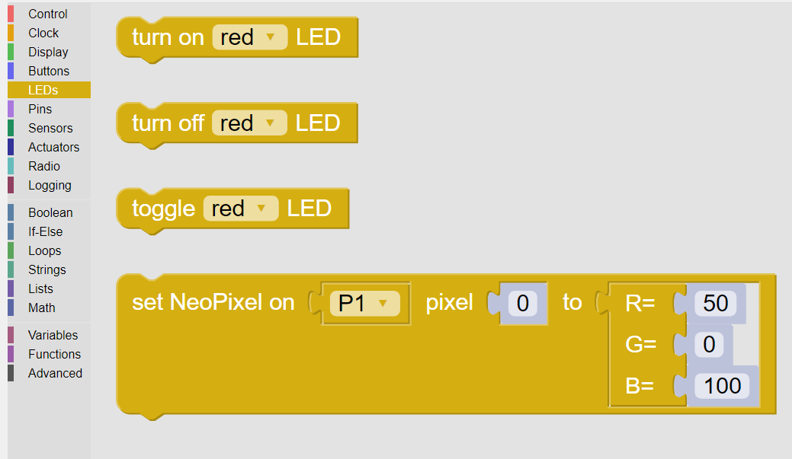

----
LEDs
----

This LEDs category supports the three LED’s that are beneath the display on the Kookaberry. 

These LEDs are coloured ``red``, ``orange`` and ``green``.

In addition, support is provided for NeoPixel RGB LEDs.

   
   The palette of KookaBlockly LED blocks

Each block is described in turn below.

Turn ON LED
-----------

This block turns the LED, selected from the drop-down box, ON.

   

Turn OFF LED
------------

This block turns the LED, selected from the drop-down box, OFF.

   

Toggle LED
----------

This block toggles the LED selected in the drop-down box. 

Toggle means to change the state of the LED from OFF to ON, or from ON to OFF, depending on the LED’s state. 

.. image:: images/leds-toggle.png
   :height: 120
   :align: center
   

Set NeoPixel
------------

This block supports NeoPixel arrays connected to one of the connections selected in the drop- 
down box. 

Neopixels are multicolour LEDs with Red, Green and Blue LEDs in every individual Neopixel.  The 
apparent colour of a Neopixel is the result of mixing the Red Green and Blue colours, in the same 
way that a television screen produces colours.

Neopixels come as single units or in chains of multiple Neopixels.

   
The following are the controls that can be set or manipulated on this block:

Pin
    The Kookaberry has five connectors on the back, ``P1`` through to ``P5``, with connector ``P3`` having 
    two possible connection points: ``P3A`` and ``P3B``. (see the :doc:`pins` category description).

pixel
    This is an integer commencing at ``0`` which specifies which pixel in the array will be set.

.. important:: 
    The Kookaberry can only supply a limited amount of current power a NeoPixel array.  
    It is recommended to use no more than 8 NeoPixels, and also to limit the brightness of each to no more than ``50`` when using more than 4 NeoPixels.

    If more NeoPixels and/or brighter illumination is required, then a special power adapter between the Kookaberry and the NeoPixel array is recommended.

RGB values
    Each of the R (red), G (green) and B (blue) values can be set with integers in the rang ``0`` to ``100`` inclusive.

    By varying the ratio of RGB values set, a wide range of colours can be achieved.

.. figure:: images/leds-rgb-venn-diagram.png
   :width: 300
   :align: center
   
   RGB Primary Colour Combinations

Learn more about using NeoPixels here: https://learn.auststem.com.au/peripheral/rgb-led/
