-----
Lists
-----

A **List** is an array of zero or more items which can be :doc:`variables`, numbers, characters, text, or other Lists.

The **Lists** category provides a large number of blocks to create and manipulate Lists.

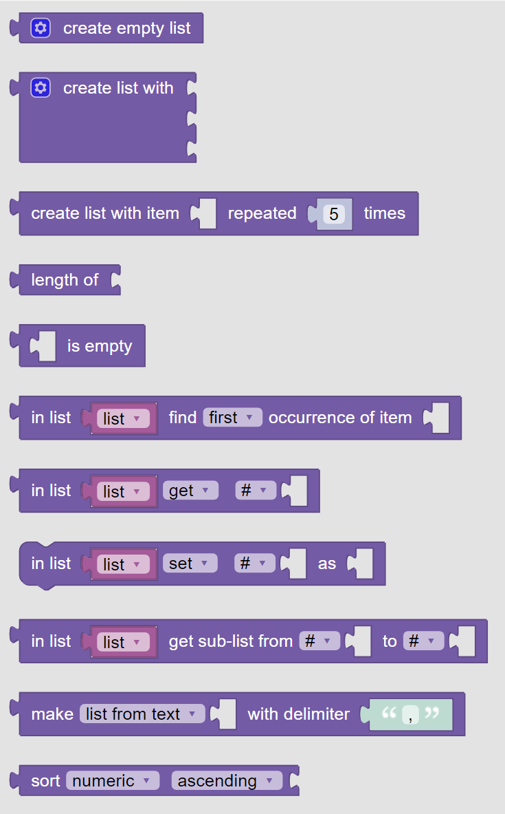
   
   The palette of **KookaBlockly** List blocks

To create a **List**, first create a **Variable** with the name of the List, and then set its value to that returned by the **Create List** block.

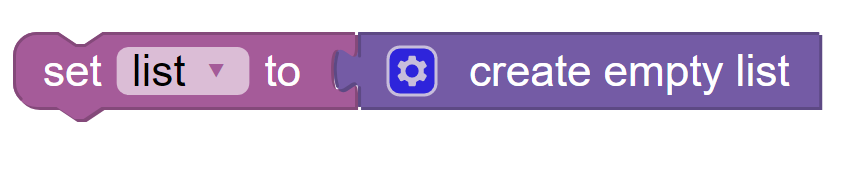

See the :doc:`variables` Category to learn about creating and using **Variables**.

Create List
-----------

This value block gives back a new, empty list.  

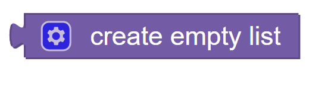

The gear icon in the block allows the user custom tailor the block to add items.

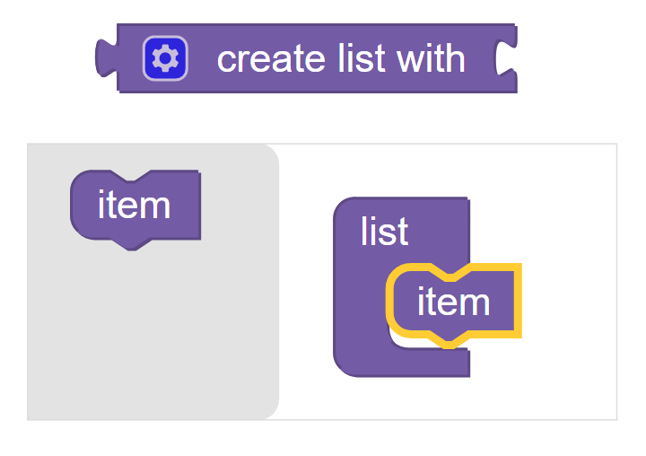

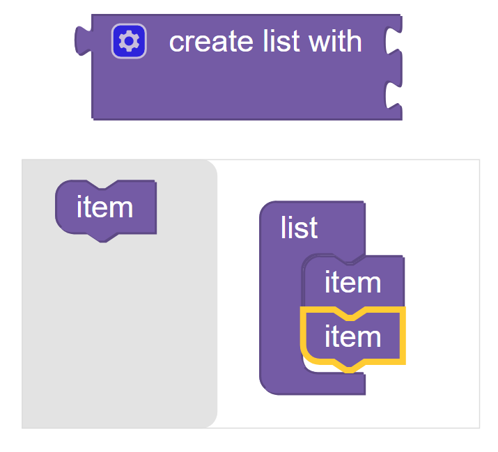

Here is an example of setting the value of a variable called ``"list"`` to a list of the names of Greek letters: ``[“alpha”, “beta”, "gamma"]``.

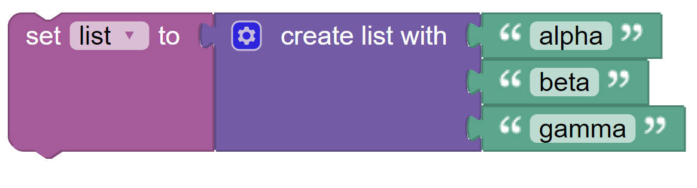

Create List With Item Repeated No. of Times
-------------------------------------------

This action block creates a new list with the left-hand socketed item repeated several times as 
specified by the number inserted into the right-hand socket.

In this example, a variable called ``”list”`` is set to a list of the number ``“123”`` repeated ``5`` 
time, that is: ``[123, 123, 123, 123, 123]``.

 
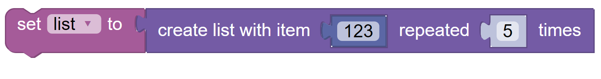

Length Of List
--------------

This value block calculates the number of items in the socketed list.

In this example the number of items in ``"list"`` which contains ``[“alpha”, “beta”, “gamma”]`` is printed on the display as ``Length of list is 3``.

 
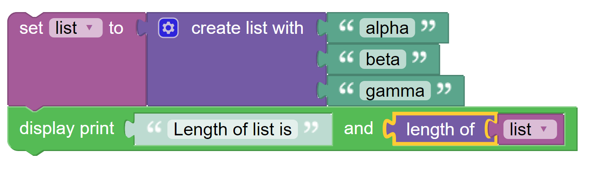

Is Empty
--------

This :doc:`boolean` value block is ``True`` if the socketed list is empty (i.e. it has no items in it) or is ``False`` if the list has members.

 
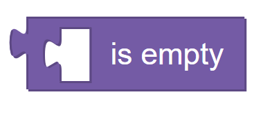

In List Find First / Last Occurrence of Item
--------------------------------------------

This value block searches a list for a given item and is set to the index, a numeric integer,
in the list at which the item was found, if it was found. 

A list index ranges from ``0`` to ``n-1``, where ``n`` is the number of items in the list. 
List indexing follows the rules of **KookaBlockly**'s underlying Python programming language.

If the item  was not found the value block is set to ``-1`` instead.  

The first input socket accepts the variable which is a list, and the second input item specifies 
the value that is being searched for.

The drop-down list gives the choice of finding the ``first`` or the ``last`` occurrence of the specified item in the list.

 
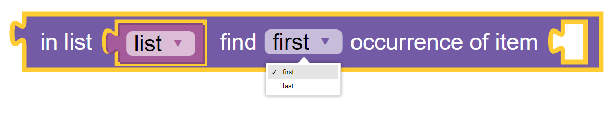

In this example we search for the first occurrence of ``“gamma”`` in the list ``[“alpha”, “beta”, “gamma”]`` 
and print the result on the display as ``Index is 2``,  ``"gamma"`` being the third item in the list.

 
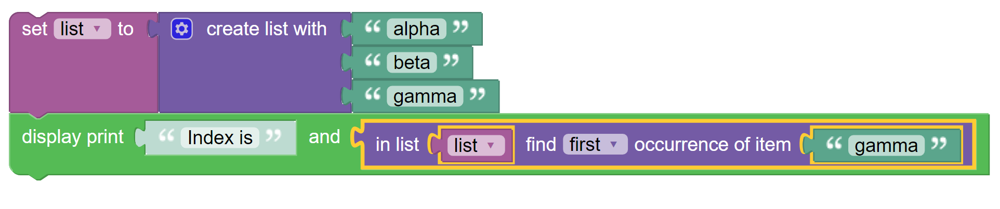

In List Get / Remove Item
-------------------------

This value block operates on a list to retrieve, retrieve and remove, or just remove an item at a 
particular position in the list.  The value of the list item is returned as the result of the block.

The images show the block and the drop-down list of the operation choices available in the block:

1. **get** fetches the indexed item from the list without altering the list's content
2. **get and remove** fetches the indexed item from the list and then deletes it from the list.  The length of the list reduces by one.
3. **remove** deletes the indexed item from the list.  This is an action block and does not return any value.

 
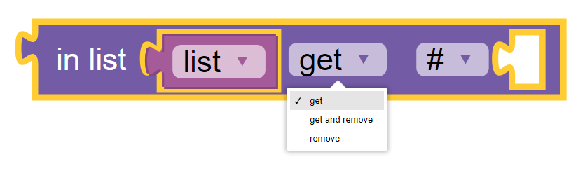

 
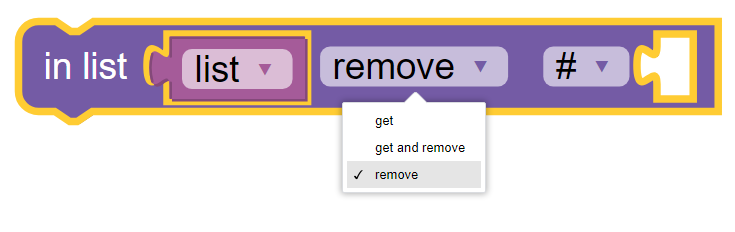

The second drop-down list has a number of choices as to which item in the list to get or set:

1. **#** the index of the item in the list
2. **# from end** the #th item from the end, where ``0`` would be the last item, ``1`` the second-last item etc.
3. **first** the first item in the list. The index input will not be present.
4. **last** the last item in the list.  The index input will not be present.
5. **random** uses a random item from the list. The index input will not be present.

 
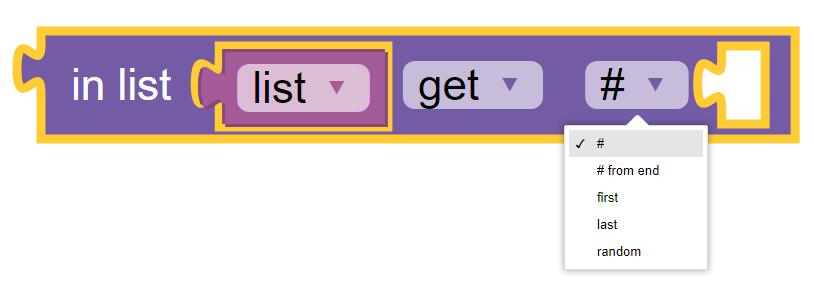

In this example, the variable item is set to the result of getting the item with index 2 from the list containing ``[“alpha”, “beta”, “gamma”]``.
The result is printed on the display as ``Item is gamma``.

 
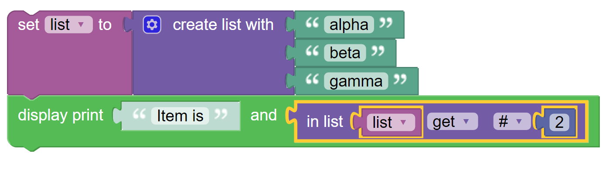

In this example, items from a list containing ``[“alpha”, “beta”, “gamma”]``, are removed and printed on the display until the list is empty.

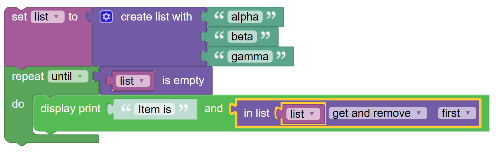

In List Set / Insert Item
-------------------------

This action block either changes the value of an item at a specified location to the socketed value 
or inserts a new item with the socketed value at the specified location in a chosen list.

The first parameter is a drop-down list with the operation choices:

1. **set** writes the input value to the indexed item in the list, overwriting its prior value
2. **insert at** creates a new member of the list at the indexed position with the input value.  
   The members from the old index onwards are shifted into the next position and the length of the list increases by one.

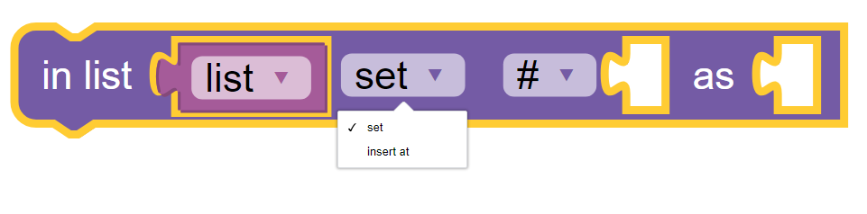

The second drop-down list has a number of choices as to which item in the list to set or insert:

1. **#** the index of the item in the list
2. **# from end** the #th item from the end, where ``0`` would be the last item, ``1`` the second-last item etc.
3. **first** the first item in the list. The index input will not be present.
4. **last** the last item in the list.  The index input will not be present.
5. **random** uses a random item from the list. The index input will not be present.

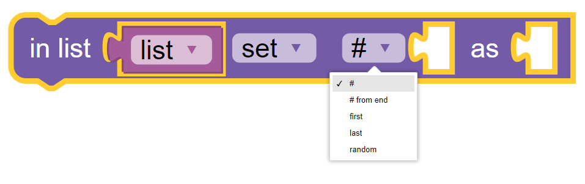

By way of example, we may wish to add ``"delta"`` to the end of the list initially containing the values ``[“alpha”, “beta”, “gamma”]``.

 .. image:: images/lists-insert-at-example.png
   :width: 400
   :align: center

In List Get Sub-List
--------------------

This value block copies a portion of a chosen list and provides the sublist as its output.  
As for the **Create List** block, a variable is needed to contain the output sublist.

The sublist portion starts from the first chosen index and ends at and includes the second chosen index.

Two drop-down boxes provide options for specifying the beginning index and the ending index:

1. **#** the index of the item in the list
2. **# from end** the #th item from the end, where ``0`` would be the last item, ``1`` the second-last item etc.
3. **first** the first item in the list, only for the beginning index. The index input will not be present.
4. **last** the last item in the list, only for the ending index.  The index input will not be present.

The beginning index must be less than or equal to the ending index. If not, an error will be raised and the script will terminate.

 .. image:: images/lists-get-sublist.png
   :width: 500
   :align: center

In this example a smaller list is assigned to variable “sublist” comprising the the items from 
index number 1 to the last item in the list containing ``[“alpha”, “beta”, “gamma”, "delta"]``.  

The sublist will contain ``[“beta”, ”gamma”, delta”]``.

 .. image:: images/lists-get-sublist-example.png
   :width: 500
   :align: center

Make List / Text With Delimiter
-------------------------------

This value block will, depending on the option chosen in the drop-down list:

1. **list from text** parses a text string into items separated by the delimiter text and arranges the items into a list.
2. **text from list** takes the items in a list and concatenates them into a text string separated by the delimiter text.

 .. image:: images/lists-make-with-delimiter.png
   :width: 500
   :align: center

An example is to parse a text string into a list.  The text string contains the first four Greek letters 
separated by commas.  The results is a list of the Greek letters as the variable “letters”.

 .. image:: images/lists-create-with-delimiter.png
   :width: 600
   :align: center

The complementary operation is to generate the original text from the list containing ``[“alpha”, “beta”, “gamma”, "delta"]`` and to print 
it on the Kookaberry’s display.

 .. image:: images/lists-text-with-delimiter-example.png
   :width: 600
   :align: center

Sort List
---------

This value block allows a list to be re-ordered by sorting in numeric or alphabetic order in an ascending or descending format. 

The first option is for the type of sorting:

1. **numeric** if the list contains numbers, the list will be sorted in numeric order
2. **alphabetic** the list will be sorted according to the ASCII character codes of the contents. See https://www.ascii-code.com
3. **alphabetic, ignore case** the list is sorted into ASCII code order, but all letters are treated as lower-case.

 .. image:: images/lists-sort-type.png
   :width: 400
   :align: center

The second option is for the order of sorting:

1. **ascending** the list is ordered from low to high values
2. **descending** the list is ordered from high to low values

 .. image:: images/lists-sort-order.png
   :width: 400
   :align: center

This example prints the items in the list containing ``[“alpha”, “beta”, “gamma”, "delta"]`` on successive rows of the Kookaberry display in 
alphabetical order.

 .. image:: images/lists-sort-example.png
   :width: 500
   :align: center

The result of the example can be seen on the Kookaberry's display where the sorted order of the list is printed on successive lines:

 .. image:: images/lists-sort-example-display.png
   :height: 200
   :align: center

