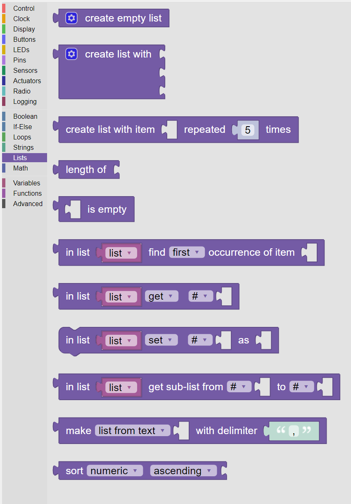

-----
Lists
-----

The **Lists** category, shown in :numref:`listpalette`, provides a large number of blocks to create and manipulate **Lists**.

.. _listpalette:

   
   The palette of **KookaBlockly** **List** blocks

A **List** is an array of zero or more items which can be :doc:`variables`, numbers, characters, text, or other **Lists**.

To create a **List**, first create a **Variable** with the name of the **List**, and then set its value to that returned by the **Create List** block.

.. image:: images/lists-variable.png
   :scale: 50%
   :align: center
   :alt: Set Variable to List

See the :doc:`variables` Category to learn about creating and using **Variables**.

Create List
-----------

This value block gives back a new, empty **List**.  

.. image:: images/lists-create-empty.png
   :scale: 50%
   :align: center
   :alt: Create Empty List Block

The gear icon in the block allows the user custom tailor the block to add items.

.. image:: images/lists-create-with-1.png
   :scale: 50%
   :align: center
   :alt: Create List With One Item

.. image:: images/lists-create-with-2.png
   :scale: 50%
   :align: center
   :alt: Create List With Two Items

Create List Example
~~~~~~~~~~~~~~~~~~~

Here is an example of setting the value of a variable called ``"list"`` to a **List** of the names of Greek letters: ``[“alpha”, “beta”, "gamma"]``.

Create List With Item Repeated No. of Times
-------------------------------------------

This action block creates a new **List** with the left-hand input item repeated several times as 
specified by the number inserted into the right-hand input.
 

In this example, a variable called ``”list”`` is set to a **List** of the number ``“123”`` repeated ``5`` 
time, that is: ``[123, 123, 123, 123, 123]``.

Length Of List
--------------

This value block calculates the number of items in the input **List**.

In this example the number of items in ``"list"`` which contains ``[“alpha”, “beta”, “gamma”]`` is printed on the display as ``Length of list is 3``.

 

Is Empty
--------

This :doc:`boolean` value block is ``True`` if the input **List** is empty (i.e. it has no items in it) or is ``False`` if the **List** has members.

 

In List Find First / Last Occurrence of Item
--------------------------------------------

This value block searches a **List** for a given item and is set to the index, a numeric integer,
in the **List** at which the item was found, if it was found. 

.. image:: images/lists-find-occurrence.png
   :scale: 50%
   :align: center
   :alt: Find Occurrence in List

A **List** index ranges from ``0`` to ``n-1``, where ``n`` is the number of items in the **List**. 
**List** indexing follows the rules of **KookaBlockly**'s underlying Python programming language.

If the item  was not found the value block is set to ``-1`` instead.  

The first input socket accepts the variable which is a **List**, and the second input item specifies 
the value that is being searched for.

The drop-down list gives the choice of finding the ``first`` or the ``last`` occurrence of the specified item in the **List**.

In List Find Example
~~~~~~~~~~~~~~~~~~~~

In this example we search for the first occurrence of ``“gamma”`` in the **List** ``[“alpha”, “beta”, “gamma”]`` 
and print the result on the display as ``Index is 2``,  ``"gamma"`` being the third item in the **List**.
 
.. image:: images/lists-find-occurrence-example.png
   :scale: 50%
   :align: center
   :alt: Find Occurrence in List Example

In List Get / Remove Item
-------------------------

This value block operates on a **List** to retrieve, retrieve and remove, or just remove an item at a 
particular position in the **List**.  The value of the **List** item is returned as the result of the block.

.. image:: images/lists-get.png
   :scale: 50%
   :align: center
   :alt: Get Item From List Block

The images show the block and the drop-down list of the operation choices available in the block:

1. **get** fetches the indexed item from the **List** without altering the **List**'s content
2. **get and remove** fetches the indexed item from the **List** and then deletes it from the **List**.  The length of the **List** reduces by one.
3. **remove** deletes the indexed item from the **List**.  This is an action block and does not return any value.

 

The second drop-down list has a number of choices as to which item in the **List** to get or set:

1. **#** the index of the item in the **List**
2. **# from end** the #th item from the end, where ``0`` would be the last item, ``1`` the second-last item etc.
3. **first** the first item in the **List**. The index input will not be present.
4. **last** the last item in the **List**.  The index input will not be present.
5. **random** uses a random item from the **List**. The index input will not be present.

 
.. image:: images/lists-get-index.png
   :scale: 50%
   :align: center
   :alt: Get List Item Index Block

In List Get / Remove Examples
~~~~~~~~~~~~~~~~~~~~~~~~~~~~~

In this example, the variable item is set to the result of getting the item with index 2 from the **List** containing ``[“alpha”, “beta”, “gamma”]``.
The result is printed on the display as ``Item is gamma``.

 
.. image:: images/lists-get-example.png
   :scale: 50%
   :align: center
   :alt: Get Item From List Example

In this example, items from a **List** containing ``[“alpha”, “beta”, “gamma”]``, are removed and printed on the display until the **List** is empty.

.. image:: images/lists-get-remove-example.png
   :scale: 50%
   :align: center
   :alt: Remove Item From List Example

In List Set / Insert Item
-------------------------

This action block either changes the value of an item at a specified location to the input value 
or inserts a new item with the input value at the specified location in a chosen **List**.

.. image:: images/lists-set.png
   :scale: 50%
   :align: center
   :alt: Set Item In List Block

The first parameter is a drop-down list with the operation choices:

1. **set** writes the input value to the indexed item in the **List**, overwriting its prior value
2. **insert at** creates a new member of the **List** at the indexed position with the input value.  
   The members from the old index onwards are shifted into the next position and the length of the **List** increases by one.

The second drop-down list has a number of choices as to which item in the **List** to set or insert:

1. **#** the index of the item in the **List**
2. **# from end** the #th item from the end, where ``0`` would be the last item, ``1`` the second-last item etc.
3. **first** the first item in the **List**. The index input will not be present.
4. **last** the last item in the **List**.  The index input will not be present.
5. **random** uses a random item from the **List**. The index input will not be present.

In List Set / Insert Example
~~~~~~~~~~~~~~~~~~~~~~~~~~~~

By way of example, we may wish to add ``"delta"`` to the end of the **List** initially containing the values ``[“alpha”, “beta”, “gamma”]``.

 .. image:: images/lists-insert-at-example.png
   :scale: 50%
   :align: center
   :alt: Set Item In List Example

In List Get Sub-List
--------------------

This value block copies a portion of a chosen **List** and provides the **Sub-List** as its output.  

 .. image:: images/lists-get-sublist.png
   :scale: 50%
   :align: center
   :alt: Get Sub-List Block

As for the **Create List** block, a variable is needed to contain the output **Sub-List**.

The **Sub-List** portion starts from the first chosen index and ends at and includes the second chosen index.

Two drop-down boxes provide options for specifying the beginning index and the ending index:

1. **#** the index of the item in the **List**
2. **# from end** the #th item from the end, where ``0`` would be the last item, ``1`` the second-last item etc.
3. **first** the first item in the **List**, only for the beginning index. The index input will not be present.
4. **last** the last item in the **List**, only for the ending index.  The index input will not be present.

The beginning index must be less than or equal to the ending index. If not, an error will be raised and the script will terminate.

Get Sub-List Example
~~~~~~~~~~~~~~~~~~~~

In this example a smaller **List** is assigned to variable “sublist” comprising the the items from 
index number 1 to the last item in the **List** containing ``[“alpha”, “beta”, “gamma”, "delta"]``.  

 .. image:: images/lists-get-sublist-example.png
   :scale: 50%
   :align: center
   :alt: Get Sub-List Example

The **Sub-List** will contain ``[“beta”, ”gamma”, delta”]``.

Make List / Text With Delimiter
-------------------------------

This value block will, depending on the option chosen in the drop-down list:

1. **list from text** parses a text string into items separated by the delimiter text and arranges the items into a **List**.
2. **text from list** takes the items in a **List** and concatenates them into a text string separated by the delimiter text.

 .. image:: images/lists-make-with-delimiter.png
   :scale: 50%
   :align: center
   :alt: Create/Get List With Delimited Text Block

Make List / Text Examples
~~~~~~~~~~~~~~~~~~~~~~~~~

An example is to parse a text string into a **List**.  The text string contains the first four Greek letters 
separated by commas.  The results is a **List** of the Greek letters as the variable “letters”.

 .. image:: images/lists-create-with-delimiter.png
   :scale: 50%
   :align: center
   :alt: Create List From Text Example

The complementary operation is to generate the original text from the **List** containing ``[“alpha”, “beta”, “gamma”, "delta"]`` and to print 
it on the **Kookaberry’s** display.

 .. image:: images/lists-text-with-delimiter-example.png
   :scale: 50%
   :align: center
   :alt: Create Text From List Example

Sort List
---------

This value block allows a **List** to be re-ordered by sorting in numeric or alphabetic order in an ascending or descending format. 

 .. image:: images/lists-sort-type.png
   :scale: 50%
   :align: center
   :alt: Sort List Block

The first option is for the type of sorting:

1. **numeric** if the **List** contains numbers, the **List** will be sorted in numeric order
2. **alphabetic** the **List** will be sorted according to the ASCII character codes of the contents. See https://www.ascii-code.com
3. **alphabetic, ignore case** the **List** is sorted into ASCII code order, but all letters are treated as lower-case.

 .. image:: images/lists-sort-order.png
   :scale: 50%
   :align: center
   :alt: Sort List Configuration

The second option is for the order of sorting:

1. **ascending** the **List** is ordered from low to high values
2. **descending** the **List** is ordered from high to low values

Sort List Example
~~~~~~~~~~~~~~~~~

This example prints the items in the **List** containing ``[“alpha”, “beta”, “gamma”, "delta"]`` on successive rows of the **Kookaberry** display in 
alphabetical order.

 .. image:: images/lists-sort-example.png
   :scale: 50%
   :align: center
   :alt: Sort List Example

The result of the example can be seen on the **Kookaberry**'s display where the sorted order of the **List** is printed on successive lines:

 .. image:: images/lists-sort-example-display.png
   :height: 200
   :align: center
   :alt: Sort List Example Result

