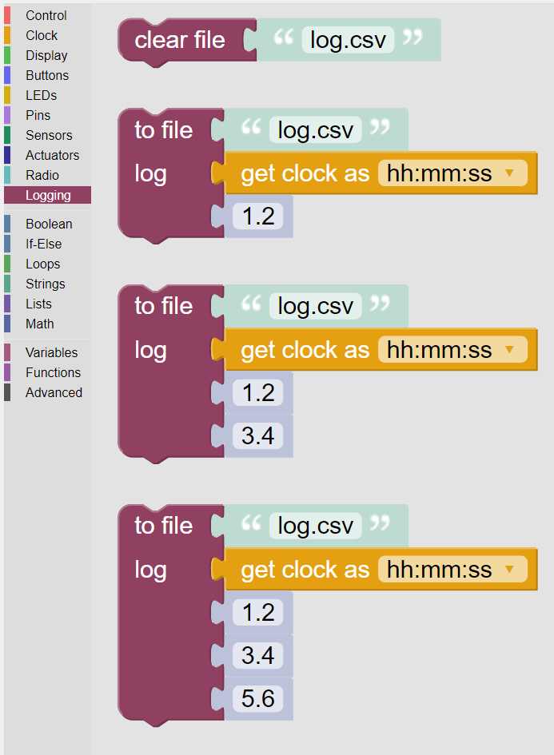

-------
Logging
-------

The Kookaberry contains a 3 to 4 megabyte (depending on hardware model) non-volatile serial memory store which is used to store 
files.  These files can be written and read by the Kookaberry and also via a USB interface by any attached computer.

Logging files are text files which are in the comma-separated-variable (CSV) format.  
That is, each line contains alphanumeric text data which are separated by commas. 
The first line of the files can be used to represent headings for the data item columns that are in the following lines.
An example of a CSV file is:

.. code:: 

    Time,Temperature,Humidity
    12:04:00,25,50
    12:09:00,26,49
    12:14:00,27,48
    etc

During experiments, data is collected over time from instruments comprising sensors.
These data are stored in a CSV file at time intervals as above.
When the experiment is finished, the data can be retrieved from the CSV file stored on the Kookaberry using a computer to perform analysis of the results.
Most commonly CSV data is used to draw graphs of the data over time using a spreadsheet program.

These blocks provide a facility for writing data into files on the Kookaberry.

   
   The palette of KookaBlockly Logging blocks

.. note:: 

    At present KookaBlockly does not directly support the reading of files from the Kookaberry's file system.
    MicroPython scripting does however contain extensive functionality for reading, writing and manipulating the Kookaberry's files.

Clear File
----------

The file block creates a new empty text file with the specified name in the Kookaberry's file system. 
If a file with the same name already exists, then it will overwritten with an empty file.

The name of the file is specified in the **to file** parameter with ``log.csv`` the default name.  Edit this field to change the file name.
This can be any legal filename, usually in the form ``name.typ``  where name is a text string and typ is a short, 
usually three letter, file type description.  

``CSV`` is the recommended file type, but other common types are: ``txt`` for text files, and ``log`` for log text files.  
File type conventions are determined by the computer operating system that will read these files.

Log To File
-----------

The **log to file** block writes the text provided by the attached value block(s) as a new line appended to the named text file.
If the text file name does not already exist, a new empty text file with the specified name will be created.

The value blocks attached as inputs to this block will provide text values to be written to the line in the file, separated by commas.

The first input, be default, is a text representation of the current time read from the Kookaberry's internal clock.  
This input block can be replaced by any other value block that provides a text string.

There are three varieties of the **Log To File** block, accepting one two or three further inputs.
These inputs also are expected to be text string representations of the data to be recorded in the file record.

.. image:: images/logging-to-file-2.png
   :height: 120
   :align: center
 

To create a heading line in the CSV file, use the appropriate **Log To File** block first within an **On Start** control block
and plug in text string value blocks with the names of each of the columns.

.. note:: 
    KookaBlockly presently supports a maximum of four data items per file record.
    If more data items are required then it is possible to use an **Advanced** block with the required MicroPython script in it.
    The **Show Script** button on the **KookaBlockly** editor will open a window with the MicroPython script derived from the current KookaBlockly script.
    Hint: Use a **Log To File** block to model the first four data items, copy the equivalent MicroPython (it all has to be on one line), 
    paste it into the **Advanced** block and modify it to suit your application.  
    You will need to learn about MicroPython nonetheless to make it work correctly.