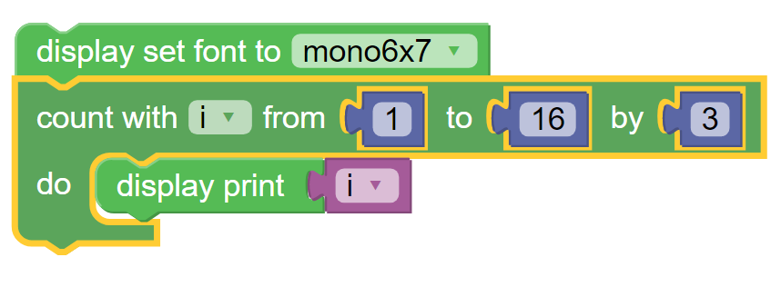
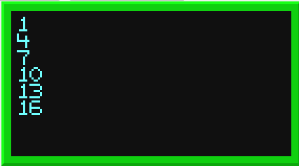

-----
Loops
-----

**Loops** are a category of control blocks, shown in :numref:`loopalette`, that direct the flow of a program.  
They run the nested action blocks a number of times in accordance with the test taken at the beginning of the **Loop**.

.. _loopalette:
.. figure:: images/loops-palette.png
   :scale: 50%
   :align: center
   
   The palette of **KookaBlockly** **Loop** blocks

Loop Repeat
-----------

This block runs the blocks nested inside of it for the specified number of times. 

.. image:: images/loops-repeat.png
   :scale: 50%
   :align: center

The number of iterations is provided by an input from a numeric value block which can contain a fixed number (from the :doc:`maths` blocks category), 
a numeric computation  (using blocks from the :doc:`maths` blocks category), or a variable. 
See also the :doc:`variables` category.

When the iterations of the **Loop** are complete the program moves on to the blocks below it.

Loop Repeat While / Until
-------------------------

In this block the two operations of While and Until are very similar to each other.  Both require a :doc:`boolean` 
``True`` / ``False`` value block in their input socket.  

.. image:: images/loops-repeat-while.png
   :scale: 50%
   :align: center

Repeat While will continue as long as the input value block is ``True``.  

Repeat Until will continue as long as the input value block is ``False``.  

Count With Variable From-To-By
------------------------------

This **Loop** will run its nested blocks several times depending upon the input numbers given.  

.. image:: images/loops-count-with.png
   :scale: 50%
   :align: center

The **Loop** will start by setting the chosen variable to its starting value using the first input.  

Each time the **Loop** completes (known as an iteration), the variable's value is changed by the number in the third input.

The **Loop** will continue to iterate until the value of the variable is equal to or greater than the number in the second input.  

So if the **Loop** is configured to run from ``0`` to ``3`` by ``1``, it would run the nested blocks with the variable’s 
value being ``0``, ``1`` and ``2``.  Then the program would advance to the next block after the 
**Loop**.  During the **Loop**, the variable’s value indicates which repetition of the **Loop** is being run and can be used in calculations. 

The variable drop-down list contains the names of the available variables. The default variables are ``i`` and ``j``.

The options **Rename variable** and **Delete variable** are configuration functions to manage the 
creation of new variables or deletion of existing variables. See also the :doc:`variables` Category.

Count With Variable Example
~~~~~~~~~~~~~~~~~~~~~~~~~~~

In :numref:`loopcountexample` is an example of the **Loop** counting between 1 and 16 by 3.  

.. _loopcountexample:

   Example script counts from 1 to 16

On each iteration of the **Loop**, the value of the variable ``i`` is printed on a new line on the display, as shown in :numref:`loopcountdisplay`.

.. _loopcountdisplay:

   The display resulting from :numref:`loopcountexample`

For Each Item In List
---------------------

This block has an input socket that takes a **List**.  See the :doc:`lists` Category.

.. image:: images/loops-for-item.png
   :scale: 50%
   :align: center

The **Loop** begins by setting the chosen variable to be the same as the first item from the **List** and then it runs the nested blocks. 

The **Loop** then sets the chosen variable as the second item of the **List** and runs the nested blocks again.  

The **Loop** repeats until it has run once for every item from the **List**.

This type of **Loop** is useful for printing a **List** of text items in subsequent lines on the **Display**, 
or for processing a **List** of readings gathered from sensors.

Break / Continue Loop
---------------------

This block must be placed inside a **Loop**.  If the block is not placed in a **Loop** it will turn white with a warning symbol - see :numref:`loopbreakwarning`.

.. _loopbreakexample:
.. figure:: images/loops-breakout-example.png
   :scale: 50%
   :align: center

   The Loop Breakout / Continue used in a **Loop**

This block is used to either break out of the **Loop**, or to stop the current iteration of a **Loop**.

* **break out** immediately ends the **Loop** and jumps to the next block after the **Loop**.   
* **continue with next iteration** stops the current iteration and jumps back to the top of the **Loop** and will run again if the **Loop** allows it.
  

The usual way to use this block is in an **If-Do** block where breaking a **Loop** is subject to a logical test as in :numref:`loopbreakexample`.

.. _loopbreakwarning:
.. figure:: images/loops-breakout-warning.png
   :scale: 50%
   :align: center

   The Warning appearance of the **Loop Breakout / Continue** block when not inside a **Loop**

