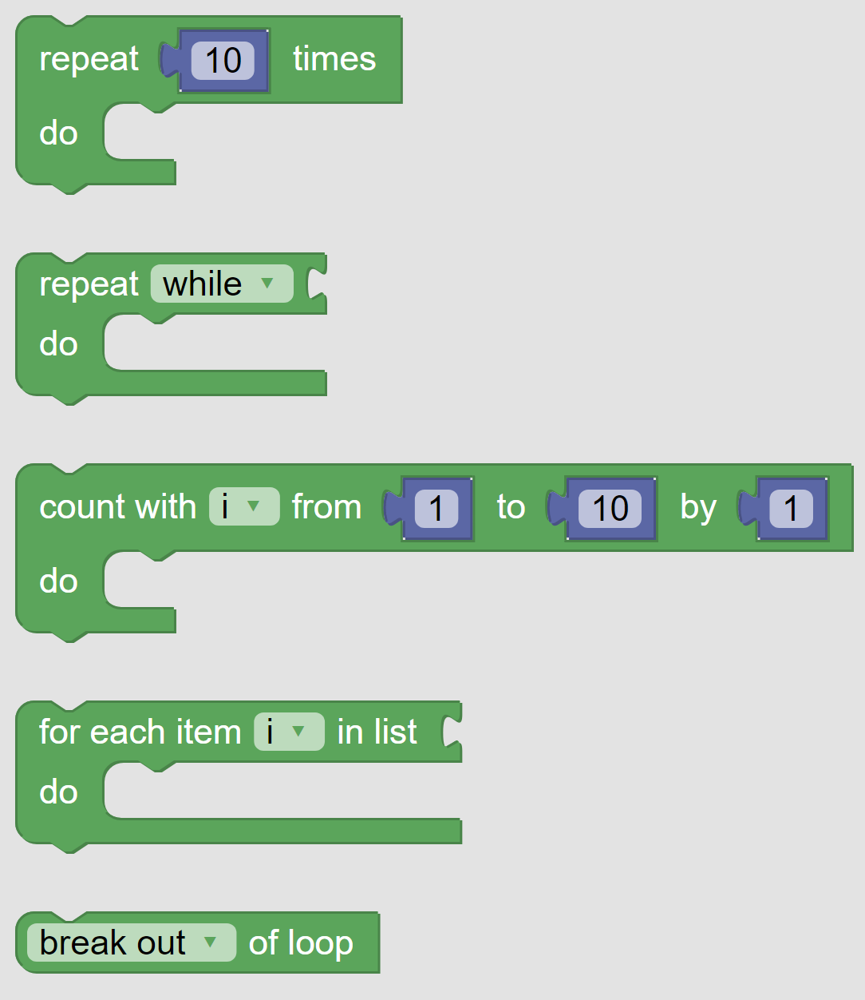
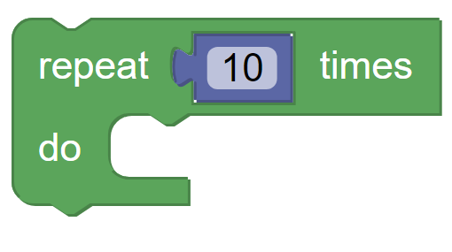
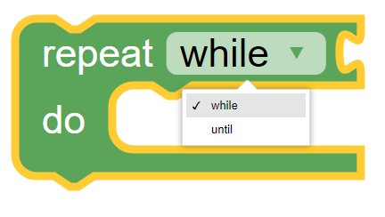
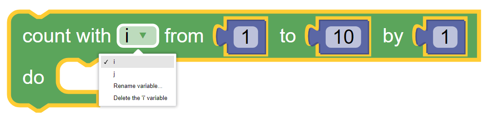
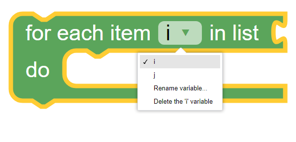
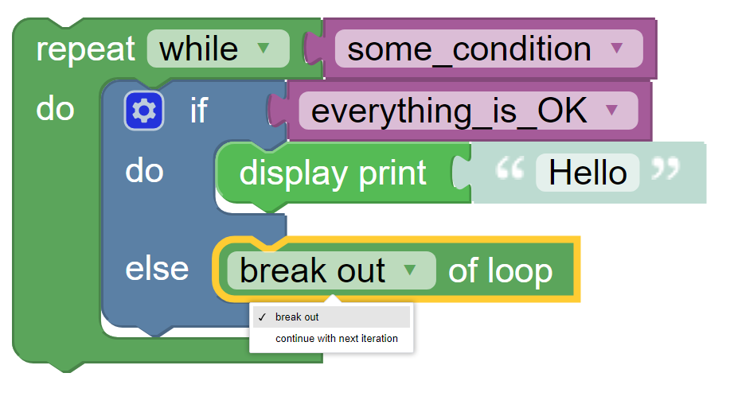
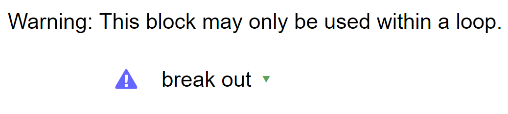

-----
Loops
-----

Loops are a category of control blocks that direct the flow of a program.  
They run the nested action blocks a number of times in accordance with the test taken at the beginning of the loop.

   
   The palette of KookaBlockly Loop blocks

Loop Repeat
-----------

This block runs the blocks nested inside of it for the specified number of times. 

The number of iterations is provided by an input from a numeric value block which can contain a fixed number, a numeric computation, or a variable. 
See also the :doc:`variables` category.

When the iterations of the loop are complete the program moves on to the blocks below it.

Loop Repeat While / Until
-------------------------

In this block the two operations of While and Until are very similar to each other.  Both require a Boolean
``True`` / ``False`` value block in their input socket.  

Repeat While will continue as long as the input value block is ``True``.  

Repeat Until will continue as long as the input value block is ``False``.  

Count With Variable From-To-By
------------------------------

This loop will run its nested blocks several times depending upon the input numbers given.  

The loop will start by setting the chosen variable to the first number.  If the variable is smaller than the second 
number it will run the nested blocks then increase the value of the variable by the third number.  

The loop will continue to iterate until the value of the variable is equal to or greater than the 
second number.  

So if the loop is configured to run from ``0`` to ``3`` by ``1``, it would run the nested blocks with the variable’s 
value being ``0``, ``1`` and ``2``.  Then the program would advance to the next block after the 
loop.  During the loop, the variable’s value indicates which repetition of the loop is being run and can be used in calculations. 

The variable drop-down list contains the names of the available variables. The default variables are ``i`` and ``j``.

The options **Rename variable** and **Delete variable** are configuration functions to manage the 
creation of new variables or deletion of existing variables. See also the :doc:`variables` Category.

For Each Item In List
---------------------

This block has a socket that takes a List.  See the :doc:`lists` Category.

The loop begins by setting the chosen variable to be the same as the first item from the list and then it runs the nested blocks.  
The loop then sets the chosen variable as the second item of the list and runs the nested blocks again.  
The loop repeats until it has run once for every item from the list.

This type of loop is useful for printing a list of text items in subsequent lines on the Display, 
or for processing a list of readings gathered from sensors.

Break / Continue Loop
---------------------

This block must be placed inside a loop.  If the block is not placed in a loop it will turn white with a warning symbol - see the figure below.

This block is used to either break out of the loop, or to stop the current iteration of a loop.

* **break out** immediately ends the loop and jumps to the next block after the loop.   
* **continue with next iteration** stops the current iteration and jumps back to the top of the loop and will run again if the loop allows it.
  

The usual way to use this block is in an **If-Do** block where breaking a loop is subject to a logical test.

   The Loop Breakout / Continue used in a loop

   The Warning appearance of the Loop Breakout / Continue block when not inside a loop

