----
Math
----

Fundamental to any computer program is the ability to do mathematical computations.  

The Math Category provides the repertoire of mathematical functions.

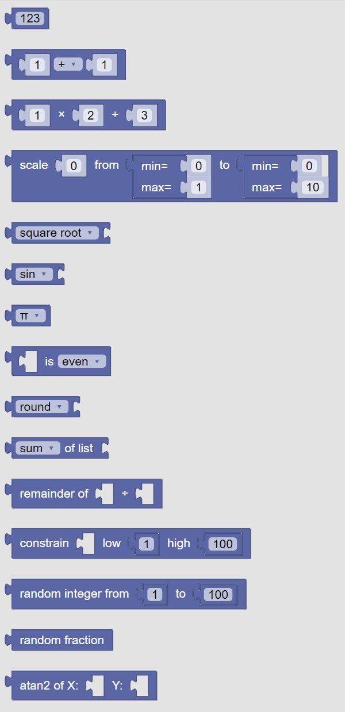
   
   The palette of KookaBlockly Math blocks

Number
------

This value block represents a fixed number that is specified by editing the default number ``123`` in the block.  

The number can be any valid integer or floating point number:

* the number can be signed, that is, preceded by the character ``+`` (default and assumed if not present) or the character ``-`` for negative numbers
* there is no limit (other than computer memory) for how large the number can be
* an integer in the form ``123456``
* a floating point number in the form ``123456.789``
* scientific notation in the form ``1.234567e5`` can be used and will be displayed in integer or floating point form as appropriate ``123456.7``

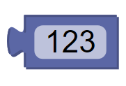

This example prints a number on the Kookaberry's display:

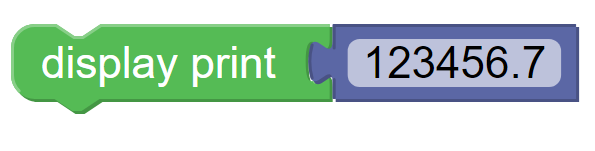

Arithmetic
----------

This value block operates on two input values or value blocks that represent numbers with the chosen 
arithmetic operator.  

The operations that can be chosen from the drop-down list are:

1. addition (+)
2. subtraction (-)
3. multiplication (x)
4. division (÷) 
5. and raised to the power of (^)

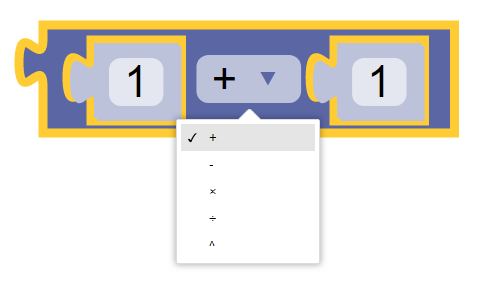

This example prints the result of ``2`` raised to the power of ``3`` (ie. 2 cubed which is ``8``) on the Kookaberry's display:

Multiply and Add
----------------

This value block multiplies the first numerical value block input by the second numerical value block input
and then adds the third numerical value input to the product of the first two inputs.

This block is a convenient way to achieve the same result as using two **Arithmetic** blocks as in the example below. 
Both blocks will print the same result (``10``).

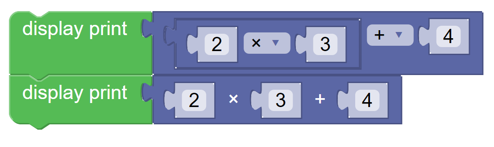

Scale Function
--------------

The **Scale** value block will perform the necessary computations to convert the number on the first input 
from a scale defined by the second input, to another scale defined by the third input.

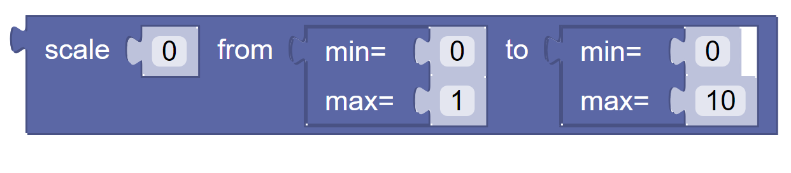

By way of example, this block will convert a Celsius water temperature sensor reading (range freezing pont ``0`` to boiling point ``100``)
into the equivalent degrees Fahrenheit (range freezing point ``32`` F to boiling point ``212`` F) and print it on the Kookaberry display.

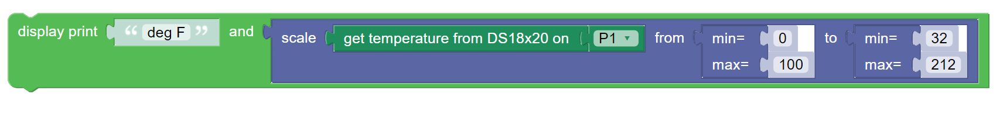

Math Function
-------------

This value block performs the chosen mathematical function on the numerical value input.  

The options that are available are:

1. square root - see https://en.wikipedia.org/wiki/Square_root
2. absolute value - see https://en.wikipedia.org/wiki/Absolute_value
3. negation (change the number's sign from positive to negative or negative to positive - the same as multiplying by ``-1``)
4. natural (base e) logarithm - see https://en.wikipedia.org/wiki/Natural_logarithm
5. base 10 logarithm - see https://en.wikipedia.org/wiki/Logarithm
6. natural exponent e^ - see https://en.wikipedia.org/wiki/Exponential_function
7. and base 10 exponent 10^ - see https://en.wikipedia.org/wiki/Exponentiation

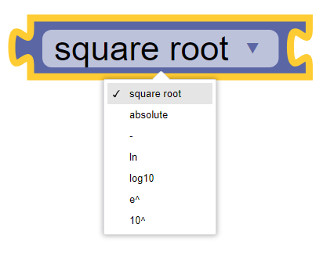

Trigonometric Function
----------------------

This value block performs the basic selected trigonometric functions on the socketed numerical 
value block.  It also has the inverse of the basic trigonometric functions.

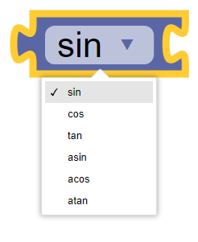

Special Constants
-----------------

This value block has several special numbers to choose from including pi(π) used in dealing with 
circles; e , a mathematical constant; phi(ϕ) being the golden ratio; the square root of 2; the 
square root of ½ and infinity (∞).

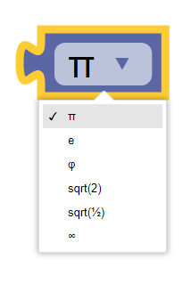

Number Property Test
--------------------

This value block gives a True or False value depending on whether the socketed numerical value 
block has the chosen property or not.  Properties to test include:  even, odd, prime, whole, 
positive, negative and divisible by.  If ‘divisible by’ is selected it will add a second socket for the 
number to test against.

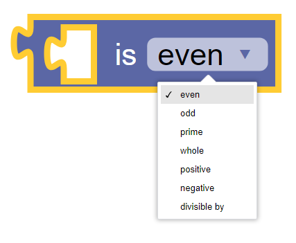

Round Number
------------

This value block rounds the socketed numerical value block with the chosen method.  Round 
rounds the number in the standard manner, ie 0.5 rounds up and below 0.5 rounds down. 
Round Up always rounds up if there is any fraction and Rounds Down removes any fractional component.

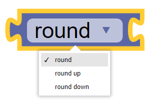

List Operations
---------------

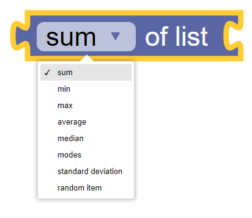

Remainder
---------

Constrain
---------

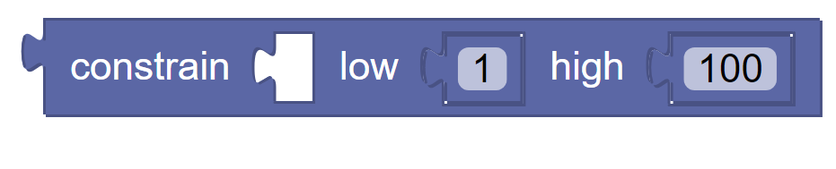

Random integer
--------------

Random Fraction
---------------

This value block creates a random number from 0 up to but not including 1

Atan2 of X
----------

This value block returns the arc tangent of two numerical value blocks x and y .  It is similar to 
calculating the arc tangent of y/x, except that the signs of both arguments are used to determine 
the quadrant of the result.  The result is an angle expressed in radians.

See also https://en.wikipedia.org/wiki/Atan2

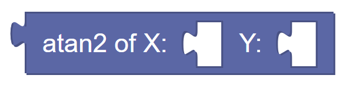

