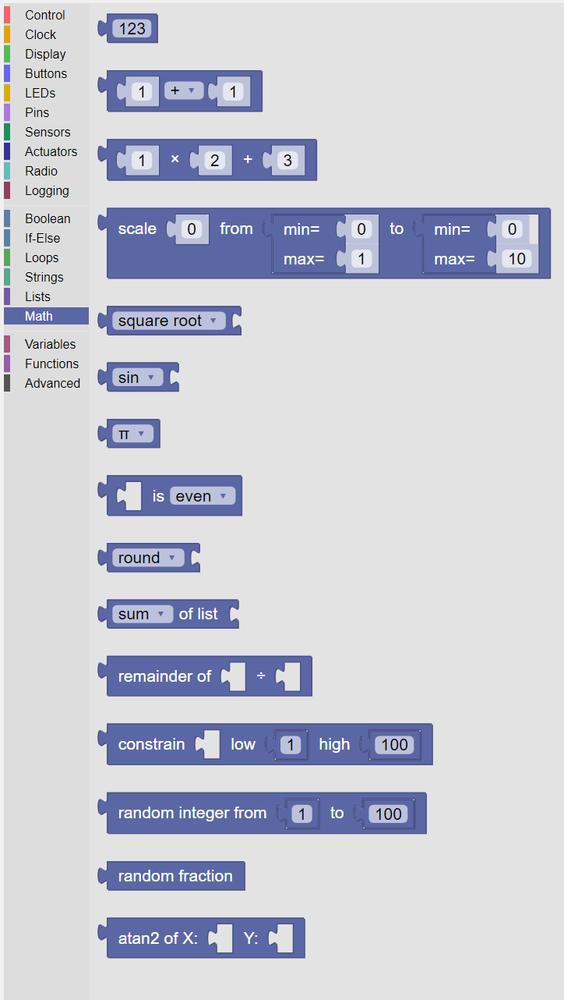
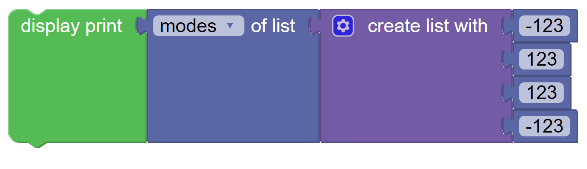

----
Math
----

Fundamental to any computer program is the ability to do mathematical computations.  

The Math Category provides the repertoire of mathematical functions.

   
   The palette of KookaBlockly Math blocks

Number
------

This value block represents a fixed number that is specified by editing the default number ``123`` in the block.  

The number can be any valid integer or floating point number:

* the number can be signed, that is, preceded by the character ``+`` (default and assumed if not present) or the character ``-`` for negative numbers
* there is no limit (other than computer memory) for how large the number can be
* an integer in the form ``123456``
* a floating point number in the form ``123456.789``
* scientific notation in the form ``1.234567e5`` can be used and will be displayed in integer or floating point form as appropriate ``123456.7``

This example prints a number on the Kookaberry's display:

Arithmetic
----------

This value block operates on two input values or value blocks that represent numbers with the chosen 
arithmetic operator.  

The operations that can be chosen from the drop-down list are:

1. addition (+)
2. subtraction (-)
3. multiplication (x)
4. division (÷) 
5. and raised to the power of (^)

This example prints the result of ``2`` raised to the power of ``3`` (ie. 2 cubed which is ``8``) on the Kookaberry's display:

Multiply and Add
----------------

This value block multiplies the first numerical value block input by the second numerical value block input
and then adds the third numerical value input to the product of the first two inputs.

This block is a convenient way to achieve the same result as using two **Arithmetic** blocks as in the example below. 
Both blocks will print the same result (``10``).

Scale Function
--------------

The **Scale** value block will perform the necessary computations to convert the number on the first input 
from a scale defined by the second input, to another scale defined by the third input.

By way of example, this block will convert a Celsius water temperature sensor reading (range freezing pont ``0`` to boiling point ``100``)
into the equivalent degrees Fahrenheit (range freezing point ``32`` F to boiling point ``212`` F) and print it on the Kookaberry display.

Math Function
-------------

This value block performs the chosen mathematical function on the numerical value input.  

The options that are available are:

1. square root - see https://en.wikipedia.org/wiki/Square_root
2. absolute value - see https://en.wikipedia.org/wiki/Absolute_value
3. negation (change the number's sign from positive to negative or negative to positive - the same as multiplying by ``-1``)
4. natural (base e) logarithm - see https://en.wikipedia.org/wiki/Natural_logarithm
5. base 10 logarithm - see https://en.wikipedia.org/wiki/Logarithm
6. natural exponent e^ - see https://en.wikipedia.org/wiki/Exponential_function
7. and base 10 exponent 10^ - see https://en.wikipedia.org/wiki/Exponentiation

Trigonometric Function
----------------------

This value block performs the basic selected trigonometric functions on the input numerical angles 
which are expected to be in degrees, or floating point numbers between ``-1`` and ``+1`` inclusive.  

See also https://en.wikipedia.org/wiki/Trigonometric_functions

The functions available for selection in the drop-down list are:

1. sine (``sin``) of the input angle - see https://en.wikipedia.org/wiki/Sine_and_cosine
2. cosine (``cos``) of the input angle - see https://en.wikipedia.org/wiki/Sine_and_cosine
3. tangent (``tan``) of the input angle - see https://en.wikipedia.org/wiki/Trigonometric_functions
4. arc-sine (``asin``) of the input value - the inverse of sine.
5. arc-cosine (``acos``) of the input value - the inverse of cosine.
6. arc-tangent (``atan``) of the input value - the inverse of tangent.

Special Constants
-----------------

This value block provides several special constants that are important and often used numbers in mathematics.

For a list of most of the mathematical special constants see https://en.wikipedia.org/wiki/List_of_mathematical_constants

To choose a constant use the drop-down list and select from

1. Pi (**π**) used in dealing with circles - see https://en.wikipedia.org/wiki/Pi
2. Euler's number (**e**) used in exponential function - see https://en.wikipedia.org/wiki/E_(mathematical_constant)
3. The Golden Ratio phi (**ϕ**) - see https://en.wikipedia.org/wiki/Golden_ratio
4. The square root of 2 - see https://en.wikipedia.org/wiki/Square_root_of_2
5. The square root of ½ - see https://en.wikipedia.org/wiki/Square_root_of_2#Multiplicative_inverse
6. Infinity (**∞**) - see https://en.wikipedia.org/wiki/Infinity

Number Property Test
--------------------

This value block gives a :doc:`boolean' ``True`` or ``False`` value depending on whether the numerical input value 
 has the chosen property or not.  
 
The property to test is selected from the drop-down list which includes:  

1. **even** - whether the input is divisible by ``2`` - see https://en.wikipedia.org/wiki/Parity_(mathematics)
2. **odd** - whether the input is not divisible by ``2`` - see https://en.wikipedia.org/wiki/Parity_(mathematics)
3. **prime** - whether the input is divisible only by ``1`` and itself - see https://en.wikipedia.org/wiki/Prime_number
4. **whole** - whether the input when divided by ``1`` leaves no remainder - see https://en.wikipedia.org/wiki/Whole_number
5. **positive** - whether the input is greater than  ``0`` - see https://en.wikipedia.org/wiki/Sign_(mathematics)
6. **negative** - whether the input is less than ``0`` - see https://en.wikipedia.org/wiki/Sign_(mathematics)
7. **divisible by** - whether the input when divided by the number in the second input leaves no remainder.  
   If **divisible by** is selected it will add a second socket for the number to test against. - See https://en.wikipedia.org/wiki/Remainder

Round Number
------------

This value block rounds the numerical input value to a whole number using the chosen method.

The method is chosen from the block's drop-down list:

1. **round** - rounds the number in the standard manner, if the fraction is greater than or equal to 0.5 it rounds up to the next more positive whole number, 
   and if the fraction is below 0.5 the block rounds down towards the negative direction. 
2. **round up** - if there is a fractional component the block always rounds up to the next more positive whole number.
3. **round down** - removes any fractional component.

Input numbers are floating point and output numbers are integers.

* **round up** means in the positive direction.
* **round down** means in the negative direction.

List Operations
---------------

This block computes a mathematical function based on the content of a list which is connected to the input to the block.

The function to be used is selected from the drop-down list:

1. **sum** - computes the arithmetic sum of the members of the list - see https://en.wikipedia.org/wiki/Summation
2. **minimum** - returns the number with the minimum value from the list - see https://en.wikipedia.org/wiki/Maximum_and_minimum
3. **maximum** - returns the number with the maximum value from the list - see https://en.wikipedia.org/wiki/Maximum_and_minimum
4. **average** - returns the arithmetic mean of the items in the list - see https://en.wikipedia.org/wiki/Arithmetic_mean
5. **median** - returns the arithmetic median of the items in the list - see https://en.wikipedia.org/wiki/Median
6. **modes** - returns a list of the most numerous items in the list (example below) - see https://en.wikipedia.org/wiki/Mode_(statistics)
7. **standard deviation** - computes the statistical standard deviation of the items in the list - see https://en.wikipedia.org/wiki/Standard_deviation
8. **random item** - returns an item from the list that has been selected at random - see also https://en.wikipedia.org/wiki/Random_variable

.. note:: 
    All functions except **modes** and **random** require that the input list contain only numerical or :doc:`boolean` items.
    Boolean items are evaluated as ``False`` = ``0`` and ``True`` = ``1``.
    The **modes** and **random** functions accept list with members of any type, i.e. numeric integer and floating point, boolean, and character strings.

This is an example of the use of **modes**.  The input list contains ``[-123, 123, 123, -123]``.  
The block returns a list of the most numerous items in the list, being ``[-123, 123]``.
If we changed the input list to ``[-123, -123, 123, -123]``, the block would return ``[-123]``, a list of one item being the most numerous.

Remainder
---------

This block returns the fractional portion of the number that results when the number at the first input is divided by the number at the second input.

For example, when ``3`` is divided by ``2`` the result is ``1.5``.  The remainder is the fractional portion which is ``0.5``.

See also https://en.wikipedia.org/wiki/Remainder

Constrain
---------

This block constrains the number at the first input to be between the minimum number defined as the second input 
and the maximum number defined as the third input.

There are three possible outputs from this block:

1. if the input number is less than the minimum number, the output will be set to the minimum number.
2. if the input is between the minimum and maximum inclusive, the number is passed through as-is.
3. if the input number is greater than the maximum number, the output will be set to the maximum number.

Random Integer
--------------

This block generates an integer number that is constrained to be from a minimum integer defined by the first input, 
and a maximum integer defined by the second input.

For example, to simulate the roll of a six-sided die, set the minimum to ``1`` and the maximum to ``6``.

See also https://en.wikipedia.org/wiki/Random_variable

Random Fraction
---------------

This value block creates a random floating point number from 0 up to but not including 1.

See also https://en.wikipedia.org/wiki/Random_variable

Atan2 of X
----------

This value block returns the arc tangent of two numerical values at inputs x and y .  

This function is similar to calculating the arc tangent of y/x, except that the signs of both arguments are used to determine 
the quadrant of the result.  The result is an angle expressed in degrees in the range ``-180`` to ``+180``.

See also https://en.wikipedia.org/wiki/Atan2

