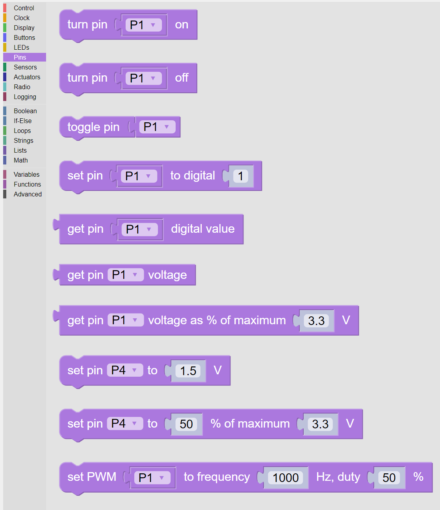

----
Pins
----

Pins are electrical connectors on the Kookaberry.  

The Kookaberry circuit board has five plugs on the rear numbered ``P1`` to ``P5``.  

``P3`` has four pins and the rest have 3 pins.  

On each connector two of the pins are used for positive and negative power connections.  The remaining pin(s) have 
multiple uses as digital or analogue inputs or outputs.

The Pins category provides the means to control what the pins do.

   
   The palette of **KookaBlockly** Pins blocks

.. note::
  In some of the Pins blocks it is possible to replace the Pins dropdown selection block with a 
  String block.   This is useful when using Pins other than those exposed on the rear of the Kookaberry, 
  or when other microprocessor boards that are compatible with Kookaberry firmware are being used.  
  In those cases type in the Pin's identifier into the String block.
  

   
   Using a String Variable instead of a Pins drop-down selection.

		

Pin Turn ON
-----------

The Pin Turn ON block causes the selected pin to behave as a digital output and to be turned on with an output voltage of +3.3 volts DC.

Pin Turn OFF
------------

The Pin OFF block causes the selected pin to behave as a digital output and to be turned off with an output voltage of 0 volts DC.

Pin Toggle
----------

The Pin Toggle  block causes the selected pin to behave as a digital output and to change state from OFF to ON, or from ON to OFF, depending on its existing state.

OFF sets the Pin to 0 volts DC, and ON sets the Pin to +3.3 volts DC.

Set Pin to Digital Value
------------------------

The Pin Set Pin Digital Value block causes the selected pin to be set to according to the integer value of the input block.

If the input value is ``0``, the output of the Pin will be set to OFF which is 0 volts DC.

If the input value is not ``0``, typically ``1`` or greater, then the output of the Pin will be set to ``1`` which is +3.3 volts DC.

Get Pin Digital Value
---------------------

This value block designates the selected pin as a digital input and returns the digital value of the 
input as either ``0`` if the input voltage is close to 0 volts DC, or ``1`` if the input voltage is closer to +3.3 
volts DC.

.. important:: 
    The allowable input voltage range for the Kookaberry is 0 volts to +3.3 volts DC.  
    Applying voltages outside that range may irreparably damage the Kookaberry.

Get Pin Voltage
---------------

This value block designates the selected pin as an analogue input and returns a floating point value of the input in volts DC.

.. important:: 
    The allowable input voltage range for the Kookaberry is 0 volts to +3.3 volts DC.  
    Applying voltages outside that range may irreparably damage the Kookaberry.

Get Pin Voltage as Percentage of Maximum
----------------------------------------
 
This value block designates the selected pin as an analogue input and returns an integer percentage value of the allowable Kookaberry input voltage range.

Applying 0 volts DC to the input Pin will resturn a value of ``0``.

Applying +3.3 volts DC to the input Pin will resturn a value of ``100``.

.. important:: 
    The allowable input voltage range for the Kookaberry is 0 volts to +3.3 volts DC.  
    Applying voltages outside that range may irreparably damage the Kookaberry.

Set Pin to Voltage
------------------

Where available on the Kookaberry the Set Pin to Voltage block causes the selected pin to behave 
as an analogue output and to be set to the voltage specified by the input block.

This feature is not available on Kookaberry using the Raspberry Pi Pico RP2040 microprocessor.

Set Pin to Percentage of Maximum
--------------------------------

Where available on the Kookaberry the Set Pin to Percentage of Maximum block causes the selected pin to behave 
as an analogue output and to be set to the percentage of maximum voltage specified by the input block.  

The output voltage will rise from 0 volts DC to +3.3 volts DC linearly with the input block rising from ``0`` to ``100``.

Pin – Pulse Width Modulation (PWM)
----------------------------------

Pulse Width Modulation (PWM) oscillates the selected Pin as a digital output between ``0`` (0 volts) 
and ``1`` (+3.3 volts DC) at a given frequency and duty cycle as specified in the input blocks.  

The duty cycle is the proportion of each oscillation in which the output state is set to 1.  A duty cycle of 50  
means that the oscillation is ``0`` for 50% of the time and `1` for the remaining 50%.

The frequency is the number of times the output cycles per second.  Frequency can be any positive floating point value

Both frequency and duty can be derived from other value blocks or specified directly.

PWM is used to apply speed control to DC motors by varying the duty cycle from 0% (motor is 
stopped) to 100% (motor at full speed). Additional circuitry is required to deliver the electrical 
power that a motor requires.

PWM can also be used to play tones through a loudspeaker by varying the frequency according 
to the pitch required.  A frequency of 440Hz corresponds to the musical note of middle A on a 
piano, for example.  Duty cycle is usually set to 50% but other interesting harmonics may be 
produced by varying the duty cycle over a limited range around 50%.  Additional circuitry is also 
required to successfully drive a loudspeaker.

.. important::
  Please note that motors and loudspeakers should not be directly plugged into a Kookaberry 
  connector.  These devices require special electronics to supply more power.  
  
  Plugging in motors or loud speakers without the necessary driving electronics may irreparably damage the Kookaberry

