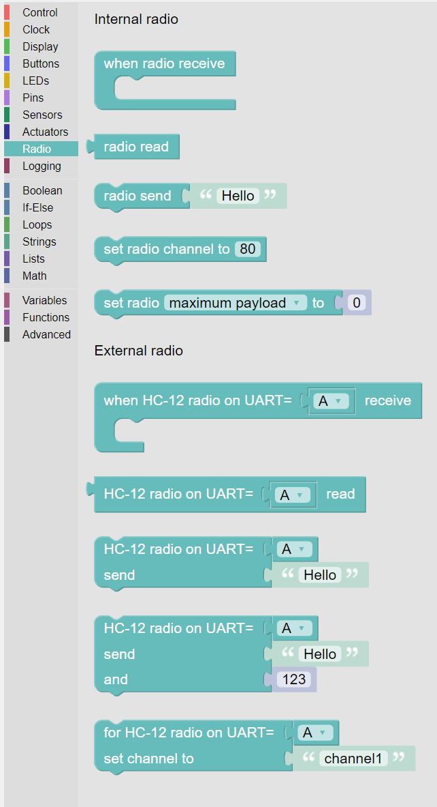

-----
Radio
-----

Radio communications between **Kookaberries** is possible using the Radio blocks shown below.

   
   The palette of **KookaBlockly** Radio blocks

Radio communications is useful for sending messages, sharing data, for remote monitoring, and for remote control.

The **Kookaberry** has an internal short-range digital packet radio, and can also connect to one or more external longer range radios.

The internal radio is compatible with the **BBC Micro:Bit**'s radio, as it uses the same radio chip, radio frequencies, and digital signalling.  
It is possible to exchange messages between the **Kookaberry** and the **Micro:Bit** provided the same radio channel is selected on both devices, 
nominally Channel 7.

Internal Radio
--------------

The **Kookaberry** is equipped with a built-in digital radio transceiver than is able to send and 
receive small amounts of digital data.  
The radio uses the same radio spectrum as WiFi signals and Bluetooth signals, and therefore has a similar range of 10 to 20 metres.
The internal radio cannot communicate using WiFi or Bluetooth directly.
All **Kookaberries** on the same radio channel can listen in to the communications on that channel.  
Similarly, multiple **Kookaberries** transmitting on the same channel may interfere with each others' communications.
Errors caused during radio communications are detected and messages with errors caused by interference will be discarded.

By default, the length of the messages that can be sent is 30 bytes or 
less when using **KookaBlockly**.  Other radio parameters such as the radio channel and speed of 
transmission are also set to default values.  

In the latest release of **KookaBlockly**, functionality has been added to alter the default parameters of the internal radio.
Care must be taken however that all the **Kookaberries** involved in communication have their radio parameters set in the same way.

The following blocks are available to control, receive and send messages using the internal **Kookaberry** radio.

When Radio Receive
~~~~~~~~~~~~~~~~~~

This is a control block which contains actions that will be taken when a message is received by the radio.  
If no message is received then no actions within the scope of the block will be taken.

Radio Read
~~~~~~~~~~

This value block will read the first radio message in the queue of radio messages received. 
Once read the radio message is deleted from the message queue.

Radio Send
~~~~~~~~~~

This action block sends the data within the attached value block as a message via the radio to be received by all other radios on the same channel.  
The data can be the result of a value block, or be a fixed message as shown above.  
The length of the message must conform to the message length limit or else a program error will result.  
Typically an alphanumeric text character occupies only one byte but some special characters may occupy two or more bytes.

.. image:: images/radio-send.png
   :height: 80
   :align: center

Set Radio channel
~~~~~~~~~~~~~~~~~

The **Kookaberry**'s internal radio is capable of transmitting and receiving on any of 84 channels.
The default radio channel is 7.

This block enables any of the available channels to be selected.

An integer value between 0 and 83 can be selected by editing the number in the block.

Messages will be sent via this channel and only messages received via this channel will be put onto the incoming message queue. 

It is therefore important that for two or more **Kookaberries** to intercommunicate, that they all be set to the same channel.
Each channel is 1MHz wide, starting at Channel 0 at 2400MHz and ending at Channel 83 at 2483MHz.

Set Radio Parameter
~~~~~~~~~~~~~~~~~~~

The **Kookaberry**'s internal radio can be configured in a variety of ways if the default settings are not suitable.
This block provides access to the numerous parameters that can be set.
Only one parameter can be set per instance of the block.  Multiple instances of the block must be used to set multiple radio parameters.
The block contains a drop-down list that enables selection of which parameter is to be set, and an input for a block that specifies the value of the selected parameter:

1. ``maximum payload`` (default=32) defines the maximum length, in bytes, of a message sent via the radio. It can be between 1 and 251 bytes long.
2. ``queue length`` (default=3) specifies the number of messages that can be stored on the incoming message queue. If there is no space left on the queue then additional incoming messages are dropped. Can be between 1 and 254.
3. ``channel`` (default=7) an integer value between 0 and 83 inclusive that defines the channel (actually frequency) to which the radio is tuned. Messages will be sent via this channel and only messages received via this channel will be put onto the incoming message queue. Each step is 1MHz wide, starting at 2400MHz.
4. ``power`` (default=6) an integer value between 0 and 7 inclusive which indicates the strength of signal used when sending a message. The higher the value the stronger the signal, but the more power is consumed by the device. The numbering translates to positions in the following list of dBm (decibel milliwatt) values: -30, -20, -16, -12, -8, -4, 0, 4.
5. ``data rate`` (default=1) indicates the speed at which data transfer (send and receive) takes place. It can be 0, 1 or 2, for 250kbit/sec, 1Mbit/sec, or 2Mbit/sec respectively
6. ``address`` (default=0x75626974) an arbitrary name, expressed as a 32-bit address, that’s used to filter incoming packets at the hardware level, keeping only those that match the address you set. The default matches that used on the micro:bit.
7. ``group`` (default=0) an 8-bit value (0-255) used in conjunction with address to filter incoming messages. This effectively makes the full address 40 bits long.
8. ``timestamp units`` (default=1) an integer 1 (TIMESTAMP_MS milliseconds) or 2 (TIMESTAMP_US microseconds) that indicates the units used in the timestamp entry returned by the receive_full() function. 

.. note:: 
    It would be very unusual to alter any of the radio parameters, other than the channel, when coding using **KookaBlockly**.

External Radio
--------------

The **Kookaberry** can be connected to up to two external radio transceivers to communicate with other **Kookaberries** 
(or other computers) that use the same radio transceivers.
The preferred radio transceiver is the HC-12 transceiver which operates in the 433Mhz radio band. 
This radio band is the same as is used for domestic applications such as garage door openers and home weather stations.
It offers the advantage of communicating over a longer range than the **Kookaberry**'s internal radio.  
Depending on the antenna fitted and the intervening radio environment, a range of at least 100 metres can be expected, with up to 1 kilometre possible in the right circumstances.
Successful communication requires that all transceivers are set to the same parameters, particularly the same radio channel.

Setting up the HC-12 to other than its default parameters is beyond the scope of **KookaBlockly**.
Please refer to the HC-12 data sheet at https://www.elecrow.com/download/HC-12.pdf.

Radios other than the HC-12 can be used provided they emulate a wired connection and do not require any control commands.  
The interface to the **Kookaberry** is via its UART (Universal Asynchronous Receiver and Transmitter) serial interface at 9600 bits/second.

Two UART interfaces are available on the **Kookaberry**:

A. This interface is accessed by using plug ``P3`` on the back of the **Kookaberry**.  This is radio ``A``.
B. This interface requires an expansion board that connects via the **Kookaberry**'s edge connector.  The plug on such a board is ``P6``.  
   This radio is designated radio ``B``.

When HC-12 Receive
~~~~~~~~~~~~~~~~~~

This is a control block which contains actions that will be taken when a message is received by the selected external radio.  
If no message is received then no actions within the scope of the block will be taken.

The drop-down list on the block selects which of the external radios (``A`` or ``B``) is being used.

HC-12 Read
~~~~~~~~~~

This value block will read the first radio message in the queue of radio messages received by the external radio. 
Once read the radio message is deleted from the message queue.

The drop-down list on the block selects which of the external radios (``A`` or ``B``) is being used.

HC-12 Send
~~~~~~~~~~

This action block sends the data within the attached value block as a message via the external radio to be received by all other radios on the same channel.  
The data can be the result of a value block, or be a fixed message as shown above.  

The drop-down list on the block selects which of the external radios (``A`` or ``B``) is being used.

HC-12 Send and
~~~~~~~~~~~~~~

This action block sends the data within the attached value blocks as a message via the external radio to be received by all other radios on the same channel.  
The data sent is a concatenation of the two value blocks.
The first block can be a descriptor (eg. **Temperature**) and the second the value derived from a temperature sensor.  

The drop-down list on the block selects which of the external radios (``A`` or ``B``) is being used.

HC-12 Set Channel
~~~~~~~~~~~~~~~~~

This block sets a virtual (named) channel for the external radio.
The external radio will send all messages with a prefix equal to the channel name.
The external radio will also only receive messages with the same channel name.

.. note:: 
    This virtual channel does not affect the radio frequency that the external radio uses.  It is only a prefix that groups messages into groups.

The drop-down list on the block selects which of the external radios (``A`` or ``B``) is being used.

.. image:: images/radio-HC12-set-channel.png
   :height: 120
   :align: center

