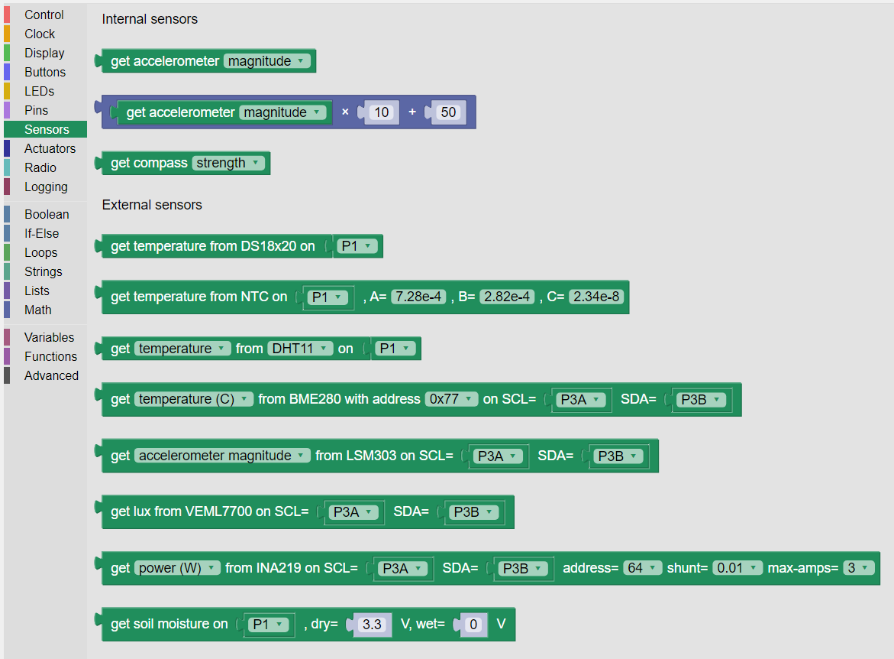
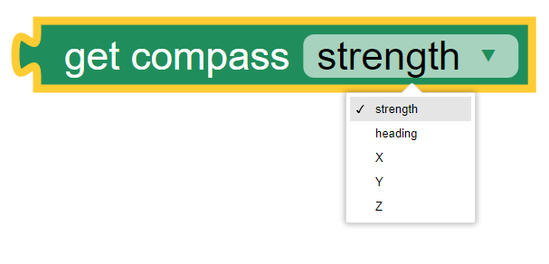
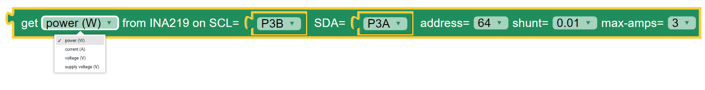

-------
Sensors
-------

The Kookaberry contains two on-board sensors, being a 3-axis accelerometer and a 
3-axis magnetometer.  

A large variety of external sensors may also be connected to the Kookaberry via its Pin connectors.  
KookaBlockly supports many external sensors as are listed under the EXternal Sensors section.  
These encompass measuring temperature, humidity, barometric pressure, soil moisture, light, electrical power, voltage and current.

The Sensors category provides blocks that enable the use of these sensors.

   
   The palette of KookaBlockly Sensors blocks

Internal Sensors
-----------------

Get Accelerometer (raw)
~~~~~~~~~~~~~~~~~~~~~~~

The Kookaberry contains an internal 3-axis accelerometer.  

The accelerometer block provides the acceleration value of the selected axis (one of the X, Y and Z axes in the 
sensor’s frame of reference), or the magnitude of the vector sum of all the axes.  The X, Y and Z axes are selected using the  drop-down list on 
the right of the block.  The values are in metres per second squared. 

.. image:: images/sensors-get-accelerometer.png
   :height: 120
   :align: center

The Kookaberry’s internal accelerometer is oriented so that the X axis is along the horizontal 
dimension of the display, the Y axis is aligned with the vertical dimension of the display, and the 
Z axis is perpendicular to the Kookaberry’s circuit board.

A typical value for acceleration is due to the earth's gravity, being 9.81 m/sec^2.  This will vary slightly with geographic
latitude and height as distances from the earth's centre of mass vary.

Get Accelerometer (scaled)
~~~~~~~~~~~~~~~~~~~~~~~~~~

The scaled accelerometer compound block is a convenient combination applying a multiplier and an offset to the raw accelerometer reading.  

The scale and offset factors can be typed in directly or provided by plugging in other value blocks.

.. image:: images/sensors-get-accelerometer-maths.png
   :height: 120
   :align: center

This block is useful to adjust the sensitivity of the accelerometer and to compensate for offsets such as the ever-present acceleration due to gravity.

Get Compass Strength
~~~~~~~~~~~~~~~~~~~~

The Kookaberry has an internal 3-axis magnetometer which can measure the magnetic field strength it is subjected to.

The value returned is an integer that is the vector sum of the xyz components of the magnetic field experienced by the sensor.

.. note::

   Blocks are missing for compass_get_xyz() and compass.get_heading()

External Sensors
----------------

Get Temperature from DS18x20
~~~~~~~~~~~~~~~~~~~~~~~~~~~~

The DS18x20 is an electronic temperature probe and this DS18x20 value block enables 
reading of the probe and returns the temperature in degrees centigrade.  The drop-down box on this 
block enables selection of which connector the sensor is attached to.

.. image:: images/sensors-get-temp-ds18b20.png
   :height: 120
   :align: center

The DS18x20 sensor is used for measuring temperature in air and in liquid.  

The sensor is pre-calibrated and performs all of the temperature calculations within the sensor.

Get Temperature from NTC
~~~~~~~~~~~~~~~~~~~~~~~~
 
The NTC (Negative Temperature Coefficient) thermocouple sensor works through measuring its resistance which reduces as temperature rises.  
The Kookaberry performs the necessary calculations to convert the sensor’s resistance to a temperature reading in degrees centigrade.

The options on the NTC value block are:
•	The connector to which the sensor is attached
•	The parameters A, B and C are the coefficients used in the Stein-Hart equation that is used to convert thermocouple resistance to temperature.  
Explaining this in more depth is beyond the scope of this manual.  It is recommended that the default values not be altered.

.. image:: images/sensors-get-temp-ntc.png
   :height: 120
   :align: center

Get Temperature or Humidity from DHT11 or DHT22
~~~~~~~~~~~~~~~~~~~~~~~~~~~~~~~~~~~~~~~~~~~~~~~

The Kookaberry supports the DHT11 and DHT22 temperature and humidity sensors.  This block obtains the value of the selected parameter from the DHT sensor.

The drop-down boxes on the DHT value block permit the selection of:

* the sensor reading to be returned: temperature (in degrees Centigrade) or relative humidity (as a percentage)
* the sensor type being used: DHT11 or DHT22
* the connector to which the sensor is connected.

The DHT sensors are only suitable for measuring air temperature.

The difference between the two sensor types is that the slightly more expensive DHT22 sensor has a higher level of accuracy and precision.  

Please be sure to select the type of DHT sensor that matches the connected sensor or else erroneous readings will result.

The manufacturers of the DHT11 and DHT22 sensors recommend an interval between successive readings of no less than 2 seconds.  
Attempting shorter intervals will result in no reading and could also cause the Kookaberry script to terminate.

Get Temperature / Humidity / Pressure from BME280
~~~~~~~~~~~~~~~~~~~~~~~~~~~~~~~~~~~~~~~~~~~~~~~~~

The BME280 sensor measures air temperature, relative humidity, and barometric air pressure. 

There is also a compatible BMP280 sensor that measures air temperature and barometric air pressure, 
but does not measure relative humidity.  Using the blocks below will return a reading of zero for humidity.

This sophisticated sensor is available mounted on Kookaberry-compatible circuit boards distributed by a variety of manufacturers.  

The interface with the Kookaberry is the I2C serial communications bus. I2C stands for Inter-Integrated-Circuit Communications (IIC or I2C).
See https://en.wikipedia.org/wiki/I%C2%B2C for more detail.

There are four wires in the I2C interface, being: 
* ``Vcc`` power at +3.3 volts DC
* ``Gnd`` ground (or negative) for signal and power at 0 volts
* ``SCL`` being the serial clock signal for communications timing
* ``SDA`` being the serial data signal which conveys the digital data being communicated

When using BME280 circuit boards it is important that these signals are connected to the correct Pins on the Kookaberry.

The **Get Temperature from BME280** block is shown below with the three sets of options available from the drop-down boxes on the block.

The first drop-down box provides the list of measurements available which are:

1.  Temperature in degrees Centigrade
2.  Air pressure in hectoPascals (aka milliBars)
3.  Relative air humidity in percent
4.  Altitude in metres relative to the first reading taken by the KookaBlockly script. That is, the first reading calibrates the altitude to zero metres.
    

.. image:: images/sensors-get-temp-bme.png
   :height: 120
   :align: center

The second drop-down box provides two options for the BME280's address on the I2C bus, that is ``0x77`` or ``0x76``.  
The default of ``0x77`` is usually the best to use but it depends on what address the manufacturer of the BME280 sensor board has chosen.
It is possible to have two BME280 sensors, each with a different address, on the same Kookaberry interface.

.. image:: images/sensors-get-temp-bme-adx.png
   :height: 120
   :align: center

The third and fourth drop-down boxes provide options as to which Pins are used for the SCL and SDA signals on the Kookaberry.
Usually the defaults of ``P3A`` for SCL and ``P3B`` for SDA will work, using the Kookaberry's **P3** 4-wire connector.  
Some BME280 boards on the market have the SCL and SDA wires swapped, which requires the selections on the block to be swapped.
Any other of the Kookaberry's connectors (**P1** to **P5**) can also be used.
A string block can also be used instead of the drop-down selector blocks and the name of the Pin typed into the block.

.. image:: images/sensors-get-temp-bme-pins.png
   :height: 120
   :align: center

Get Acceleration from LSM303
~~~~~~~~~~~~~~~~~~~~~~~~~~~~

 

.. image:: images/sensors-get-accelerometer-lsm303.png
   :height: 120
   :align: center

.. image:: images/sensors-get-accelerometer-lsm303-pins.png
   :height: 120
   :align: center

Get LUX from VEML7700
~~~~~~~~~~~~~~~~~~~~~

 

.. image:: images/sensors-get-lux-veml7700-pins.png
   :height: 120
   :align: center

Get Power / Voltage / Current from INA219
~~~~~~~~~~~~~~~~~~~~~~~~~~~~~~~~~~~~~~~~~

.. image:: images/sensors-get-power-ina219-pins.png
   :height: 120
   :align: center

Get Soil Moisture
~~~~~~~~~~~~~~~~~

 

.. image:: images/sensors-get-soil-moisture.png
   :height: 120
   :align: center

 
