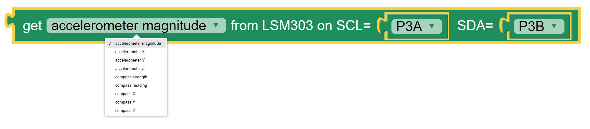
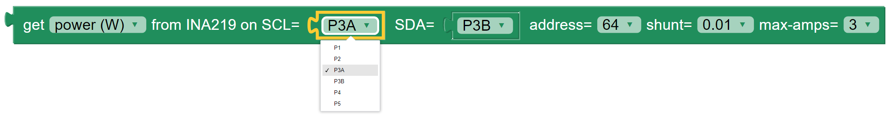
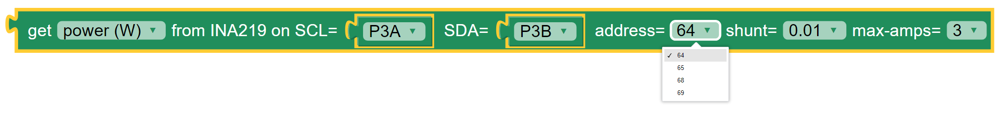
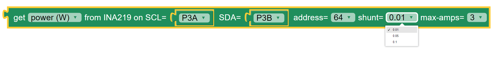

-------
Sensors
-------

The **Sensors** category provides blocks that enable the use of these sensors, as shown in :numref:`senspalette`.

.. _senspalette:
.. figure:: images/sensors-palette.png
   :scale: 50%
   :align: center
   
   The palette of **KookaBlockly** **Sensor** blocks

The **Kookaberry** contains two on-board sensors, being a 3-axis accelerometer and a 3-axis magnetometer.  

A large variety of external sensors may also be connected to the **Kookaberry** via its **Pin** connectors.  

**KookaBlockly** supports many external sensors as are listed under the **External Sensors** section.  
These encompass measuring temperature, humidity, barometric pressure, soil moisture, light, electrical power, voltage and current.

Internal Sensors
-----------------

Get Accelerometer (raw)
~~~~~~~~~~~~~~~~~~~~~~~

The **Kookaberry** contains an internal 3-axis accelerometer.  

The accelerometer block provides the acceleration value of the selected axis (one of the X, Y and Z axes in the 
sensor’s frame of reference), or the magnitude of the vector sum of all the axes.  The X, Y and Z axes are selected using the  drop-down list on 
the right of the block.  The values are in metres per second squared. 

The **Kookaberry’s** internal accelerometer is oriented so that the X axis is along the horizontal 
dimension of the display, the Y axis is aligned with the vertical dimension of the display, and the 
Z axis is perpendicular to the **Kookaberry’s** circuit board.

A typical value for acceleration is due to the earth's gravity, being 9.81 m/sec^2.  This will vary slightly with geographic
latitude and height as distances from the earth's centre of mass vary.

.. note::

   The vector sum of all acceleration axes is the square root of the sum of the squares of the three axes. That is sqrt(x^2 + y^2 + z^2).

See also See https://www.explainthatstuff.com/accelerometers.html

Get Accelerometer (scaled)
~~~~~~~~~~~~~~~~~~~~~~~~~~

The scaled accelerometer compound block is a convenient combination applying a multiplier and an offset to the raw accelerometer reading.  

The scale and offset factors can be typed in directly or provided by plugging in other value blocks.

This block is useful to adjust the sensitivity of the accelerometer and to compensate for offsets such as the ever-present acceleration due to gravity.

Get Compass
~~~~~~~~~~~

The **Kookaberry** has an internal 3-axis magnetometer which can measure the magnetic field strength
it is subjected to in three axes (X, Y and Z), as well as the total magnetic field strength, and the compass heading.

.. image:: images/sensors-get-compass-strength.png
   :scale: 50%
   :align: center

* The readings for magnetic field strength are in Gauss.
* The reading for ``heading`` are in degrees in the range ``0`` to ``359`` with ``0`` being North

See also https://en.wikipedia.org/wiki/Magnetometer

External Sensors
----------------

Sensors' Pins Connections
~~~~~~~~~~~~~~~~~~~~~~~~~

External sensors are connected to the **Kookaberry** by one of the five connectors on the back, ``P1`` through to ``P5``, 
with connector ``P3`` having two possible connection points: ``P3A`` and ``P3B``. (see the :doc:`pins` category description).

Each external sensor block has one or more input **Pins** drop-down selection blocks by which the input **Pin** can be selected. 

It is possible to replace the **Pins** dropdown selection block with a **String** block.   
This is useful when using **Pins** other than those exposed on the rear of the **Kookaberry**, 
or when other microprocessor boards that are compatible with **Kookaberry** firmware are being used.
In those cases type in the **Pin**'s identifier into the **String** block.

Get Temperature from DS18x20
~~~~~~~~~~~~~~~~~~~~~~~~~~~~

The DS18x20 Probe is a waterproof digital temperature sensor that can measure temperature from -55°C to + 125°C with an accuracy of 0.5 ° C.

This block enables reading of the probe and returns the temperature in degrees centigrade.  The drop-down box on this 
block enables selection of which **Pin** connector the sensor is attached to.

The DS18x20 sensor is used for measuring temperature in air and in liquid.  

The sensor is pre-calibrated and performs all of the temperature calculations within the sensor.

Learn how to use the sensor here: https://learn.auststem.com.au/peripheral/ds18b20/

.. note:: 

   The manufacturer of the temperature sensing DS18x20 chip requires a 4700 ohm (often referred to as a 4K7) pull-up resistor 
   to make the chip work correctly. The **Kookaberry**'s and **Pi Pico**'s internal pull up resistor may work on some DS18x20 chips but not all of them.
   Try adding a pull-up resistor between the digital input **Pin** and **Vcc** by means of a pull-up adapter module, 
   or use a different make of DS18x20 sensor if troublesome operation occurs.

Get Temperature from NTC
~~~~~~~~~~~~~~~~~~~~~~~~
 
The NTC (Negative Temperature Coefficient) thermocouple sensor works through measuring its resistance which reduces as temperature rises.  
The **Kookaberry** performs the necessary calculations to convert the sensor’s resistance to a temperature reading in degrees centigrade.

The options on the NTC value block are:

* The connector to which the sensor is attached
* The parameters A, B and C are the coefficients used in the Stein-Hart equation that is used to convert thermocouple resistance to temperature.  
  Explaining this in more depth is beyond the scope of this manual.  It is recommended that the default values not be altered.

See also https://www.explainthatstuff.com/howthermocoupleswork.html for an explanation of thermocouples.

Get Temperature or Humidity from DHT11 or DHT22
~~~~~~~~~~~~~~~~~~~~~~~~~~~~~~~~~~~~~~~~~~~~~~~

The **Kookaberry** supports the DHT11 and DHT22 temperature and humidity sensors.  
This block obtains the value of the selected parameter from the DHT sensor.

.. image:: images/sensors-get-temp-dht.png
   :scale: 50%
   :align: center

.. image:: images/sensors-get-temp-dht-select.png
   :scale: 50%
   :align: center

The drop-down boxes on the DHT value block permit the selection of:

* the sensor reading to be returned: temperature (in degrees Centigrade) or relative humidity (as a percentage)
* the sensor type being used: DHT11 or DHT22
* the connector to which the sensor is connected.

The DHT sensors are only suitable for measuring air temperature.

The difference between the two sensor types is that the slightly more expensive DHT22 sensor has a higher level of accuracy and precision.  

* the DHT11 temperature range is from 0 to 50 degrees Celsius with +-2 degrees accuracy.
* the DHT11 humidity range is from 20 to 80% with 5% accuracy.
* the DHT22 temperature measuring range is from -40 to +125 degrees Celsius with +-0.5 degrees accuracy.
* the DHT22 humidity measuring range is from 0 to 100% with 2-5% accuracy.

Please be sure to select the type of DHT sensor that matches the connected sensor or else erroneous readings will result.

The manufacturers of the DHT11 and DHT22 sensors recommend an interval between successive readings of no less than 2 seconds.  
Attempting shorter intervals will result in no reading and could also cause the **Kookaberry** script to terminate.

Learn more about using the DHT11 here: https://learn.auststem.com.au/peripheral/dht11/ and the DHT22 here: https://learn.auststem.com.au/peripheral/dht22/

Get Temperature / Humidity / Pressure from BME280
~~~~~~~~~~~~~~~~~~~~~~~~~~~~~~~~~~~~~~~~~~~~~~~~~

The **Get Temperature from BME280** block is shown below with the three sets of options available from the drop-down boxes on the block.

The first drop-down box provides the list of measurements available which are:

1.  Temperature in degrees Centigrade
2.  Air pressure in hectoPascals (aka milliBars)
3.  Relative air humidity in percent
4.  Altitude in metres relative to the first reading taken by the **KookaBlockly** script. That is, the first reading calibrates the altitude to zero metres.
   

The second drop-down box provides two options for the BME280's address on the I2C bus, that is ``0x77`` or ``0x76``.  
The default of ``0x77`` is usually the best to use but it depends on what address the manufacturer of the BME280 sensor board has chosen.
It is possible to have two BME280 sensors, each with a different address, on the same **Kookaberry** interface.

The third and fourth drop-down boxes provide options as to which **Pins** are used for the SCL and SDA signals on the **Kookaberry**.

Usually the defaults of ``P3A`` for SCL and ``P3B`` for SDA will work, using the **Kookaberry**'s **P3** 4-wire connector.  

Some BME280 boards on the market have the SCL and SDA wires swapped, which requires the selections on the block to be swapped.

Any other of the **Kookaberry**'s connectors (**P1** to **P5**) can also be used.

A string block can also be used instead of the drop-down selector blocks and the name of the **Pin** typed into the block.

About The BME280 Sensor
"""""""""""""""""""""""

The BME280 sensor measures air temperature, relative humidity, and barometric air pressure. 

There is also a compatible BMP280 sensor that measures air temperature and barometric air pressure, 
but does not measure relative humidity.  Using the blocks below will return a reading of zero for humidity.

This sophisticated sensor is available mounted on **Kookaberry**-compatible circuit boards distributed by a variety of manufacturers.  

The interface with the **Kookaberry** is the I2C serial communications bus. I2C stands for Inter-Integrated-Circuit Communications (IIC or I2C).
See https://en.wikipedia.org/wiki/I%C2%B2C for more detail.

There are four wires in the I2C interface, being: 
* ``Vcc`` power at +3.3 volts DC
* ``Gnd`` ground (or negative) for signal and power at 0 volts
* ``SCL`` being the serial clock signal for communications timing
* ``SDA`` being the serial data signal which conveys the digital data being communicated

When using BME280 circuit boards it is important that these signals are connected to the correct **Pins** on the **Kookaberry**.

Get Acceleration / Compass Strength from LSM303
~~~~~~~~~~~~~~~~~~~~~~~~~~~~~~~~~~~~~~~~~~~~~~~

The **Get Acceleration from LSM303** block is shown below with the three sets of options available from the drop-down boxes on the block.

The first drop-down box provides the list of measurements available which are:

1.  Acceleration total magnitude in metres / second squared
2.  X axis acceleration in metres / second squared
3.  Y axis acceleration in metres / second squared
4.  Z axis acceleration in metres / second squared
5.  Compass total magnetic field strength in Gauss
6.  Compass heading in degrees from North
7.  Magnetic field strength along the X axis in Gauss
8.  Magnetic field strength along the Y axis in Gauss
9.  Magnetic field strength along the Z axis in Gauss

The second and third drop-down boxes provide options as to which **Pins** are used for the SCL and SDA signals on the **Kookaberry**.

Usually the defaults of ``P3A`` for SCL and ``P3B`` for SDA will work, using the **Kookaberry**'s **P3** 4-wire connector. 

Some LSM303 boards on the market have the SCL and SDA wires swapped, which requires the selections on the block to be swapped.

Any other of the **Kookaberry**'s connectors (**P1** to **P5**) can also be used.

A string block can also be used instead of the drop-down selector blocks and the name of the **Pin** typed into the block.

About the LSM303 Sensor
"""""""""""""""""""""""

The LSM303 sensor contains a 3-axis accelerometer and a 3-axis magnetometer.  
The **Kookaberry** contains a LSM303 sensor internally, and this block provides functionality to use an externally connected LSM303 sensor.

This sensor can provide acceleration values and magnetic field strength in all three axes, 
total acceleration and total magnetic field strengths, as well as compass heading.

See https://www.explainthatstuff.com/accelerometers.html for a simple explanation of what an accelerometer is.

For an explanation of what a magnetometer is, see https://en.wikipedia.org/wiki/Magnetometer.

The interface with the **Kookaberry** is the I2C serial communications bus. I2C stands for Inter-Integrated-Circuit Communications (IIC or I2C).
See https://en.wikipedia.org/wiki/I%C2%B2C for more detail.

There are four wires in the I2C interface, being: 
* ``Vcc`` power at +3.3 volts DC
* ``Gnd`` ground (or negative) for signal and power at 0 volts
* ``SCL`` being the serial clock signal for communications timing
* ``SDA`` being the serial data signal which conveys the digital data being communicated

When using LSM303 circuit boards it is important that these signals are connected to the correct **Pins** on the **Kookaberry**.

Get LUX from VEML7700
~~~~~~~~~~~~~~~~~~~~~

The **Get Lux from VEML7700** block is shown below with the two sets of options available from the drop-down boxes on the block.

The two drop-down boxes provide options as to which **Pins** are used for the SCL and SDA signals on the **Kookaberry**.

Usually the defaults of ``P3A`` for SCL and ``P3B`` for SDA will work, using the **Kookaberry**'s **P3** 4-wire connector. 

Some VEML7700 boards on the market have the SCL and SDA wires swapped, which requires the selections on the block to be swapped.

Any other of the **Kookaberry**'s connectors (**P1** to **P5**) can also be used.

A string block can also be used instead of the drop-down selector blocks and the name of the **Pin** typed into the block.

About the VEML7700 Sensor
"""""""""""""""""""""""""

The VEML7700 is a high-accuracy ambient light sensor with an I2C serial interface to the **Kookaberry**.  

The ambient light readings are measured in Lux. Lux is the unit of illuminance, or luminous flux per unit area, in the International System of Units (SI), 
and is equal to one lumen per square metre.  See https://en.wikipedia.org/wiki/Lux for more detail.

The interface with the **Kookaberry** is the I2C serial communications bus. I2C stands for Inter-Integrated-Circuit Communications (IIC or I2C).
See https://en.wikipedia.org/wiki/I%C2%B2C for more detail.

There are four wires in the I2C interface, being: 
* ``Vcc`` power at +3.3 volts DC
* ``Gnd`` ground (or negative) for signal and power at 0 volts
* ``SCL`` being the serial clock signal for communications timing
* ``SDA`` being the serial data signal which conveys the digital data being communicated

When using a VEML7700 circuit board it is important that these signals are connected to the correct **Pins** on the **Kookaberry**.

Get Power / Voltage / Current from INA219
~~~~~~~~~~~~~~~~~~~~~~~~~~~~~~~~~~~~~~~~~

.. note:: 
   This block has not been finalised and this description is provisional and subject to change.

The **Get Power / Voltage / Current from INA219** block is shown below with the four sets of options available from the drop-down boxes on the block.

.. image:: images/sensors-get-power-ina219.png
   :scale: 50%
   :align: center

The first drop-down box provides the list of measurements available which are:

1.  Power in watts DC (direct current).  
2.  Current in amperes (amps) DC. 
3.  Load voltage in volts DC. 
4.  Power supply voltage in volts DC. 

.. note::

   The range and resolution of the INA219 sensor readings are set by the value of an internal shunt resistor, the gain, and the interfacing software. 

.. important:: 
   The safe operating range of the INA219 is given by the device's data sheet.  Nominally the maximum voltage is 26 volts, maximum current is 8 amps.

The second and third drop-down boxes provide options as to which **Pins** are used for the SCL and SDA signals on the **Kookaberry**.

Usually the defaults of ``P3A`` for SCL and ``P3B`` for SDA will work, using the **Kookaberry**'s **P3** 4-wire connector.  

Some INA219 boards on the market may have the SCL and SDA wires swapped, which requires the selections on the block to be swapped.

Any other of the **Kookaberry**'s connectors (**P1** to **P5**) can also be used.

A string block can also be used instead of the drop-down selector blocks and the name of the **Pin** typed into the block.

The fourth option on the block is the I2C address of the board.  Up to four INA219 sensors may be connected to a single I2C bus 
with any of the addresses ``64`` (hex ``0x40``), ``65`` (hex ``0x41``), ``68`` (hex ``0x44``) or ``69`` (hex ``0x45``).  
Each board must have a unique I2C address.
To change the address in the block select the desired address from the drop-down list.

The fifth option is a drop-down list of shunt resistors fitted to the sensor.  
The correct value can be obtained by consulting the data sheet for the sensor board that is being used. 
This value must be set correctly or else erroneous readings will result.
There are three options for shunt resistor values: ``0.01`` ohms, ``0.05`` ohms, and ``0.1`` ohms. 
Larger shunt resistance will improve the resolution of the current reading but will reduce the maximum current that can be measured.
Care must also be taken to not exceed the shunt resistor's power rating which is typically 2 watts.  
Power in the shunt resistor is dissipated as heat and is equal to i^2 x R, where i is current in amps, and R the resistance in ohms.

The sixth option is a drop-down list of the maximum currents to be measured.
The values in he list change according to the shunt resistance selected.  

To achieve the best resolution in current measurements, a the maximum current above and closest 
in value to the maximum current expected through the load should be selected.  
The block will try to optimise the INA219 sensor settings for a given shunt resistor and 
to avoid selecting currents which are beyond the safe operating range of the sensor.

The available combinations of shunt resistor and max-amps are shown below.

About the INA219 Sensor
"""""""""""""""""""""""

The INA219 sensor measures direct current, voltage and power from the circuit to which it is connected. It is commonly called a wattmeter.

In a direct current circuit, electrical power delivered to an electrical load (measured in watts) is the arithmetic product of 
the current flowing through the load (measured in amperes) and the voltage across the load's terminals (measured in volts).

To measure the current, a low value resistor is placed in series with the load, and the voltage across the resistor's terminal is measured.  
By applying Ohm's Law, the current can be derived (current I = voltage V / resistance R).  

See also 

* https://en.wikipedia.org/wiki/Voltmeter, 
* https://en.wikipedia.org/wiki/Ammeter and 
* https://en.wikipedia.org/wiki/Ohm%27s_law

The INA219 sensor is commonly mounted on a breakout board equipped with terminals to attach the load and a power supply, 
and a shunt resistor used to measure current flowing through the load.

The interface with the **Kookaberry** is the I2C serial communications bus. I2C stands for Inter-Integrated-Circuit Communications (IIC or I2C).
See https://en.wikipedia.org/wiki/I%C2%B2C for more detail.

There are four wires in the I2C interface, being: 
* ``Vcc`` power at +3.3 volts DC
* ``Gnd`` ground (or negative) for signal and power at 0 volts
* ``SCL`` being the serial clock signal for communications timing
* ``SDA`` being the serial data signal which conveys the digital data being communicated

When using a INA219 circuit board it is important that these signals are connected to the correct **Pins** on the **Kookaberry**.

Get Soil Moisture
~~~~~~~~~~~~~~~~~

The **Get Soil Moisture** block is shown below with three options available on the block.

Soil moisture is given as a percentage, nominally in the range 0 to 100.  
Values outside that range can be returned depending on the calibration values set in the ``dry=`` and ``wet=`` fields on the block.

The first option is a drop-down block to select which **Pin** the sensor is connected to.
A **String** block can also be used instead of the drop-down selector block and the name of the **Pin** typed into the block.

To the right of the **Pin** selector drop-down list are two fields which can be manually edited.
These are the voltages given by the sensor when it is dry and when it is wet. The default values suit a capacitive sensor.

1. For a resistive sensor, the dry value should be lower than the wet value.  ``Dry=`` 0 volts and ``wet=`` 3.3 volts are suitable starting values.
2. For a capacitive sensor, the dry value should be higher than the wet value.  ``Dry=`` 3.3 volts and ``wet=`` 0 volts are suitable starting values.

These values can be tuned with experience and the use of a calibrated soil moisture meter to improve the accuracy of the readings.

About Soil Moisture Sensors
"""""""""""""""""""""""""""

There are two types of soil moisture sensor available:

1. Resistive soil moisture sensor which measures the conductivity of soil by applying an electrical voltage using two spikes.
2. Capacitive soil moisture sensor, consisting of a single broad spike, which measures changes in the soil's capacitance due to the presence of moisture.

While both kinds of sensor are effective, the capacitive soil moisture sensor is much more durable as it is not susceptible to corrosion which affects
resistive sensors in prolonged use.

Learn more about using the resistive soil moisture sensor here: https://learn.auststem.com.au/peripheral/analogue-soil-moisture-sensor/

More Sensor Learning Resources
------------------------------

More information on sensors that can be used with the **Kookaberry** is here: https://learn.auststem.com.au/peripherals/
 
