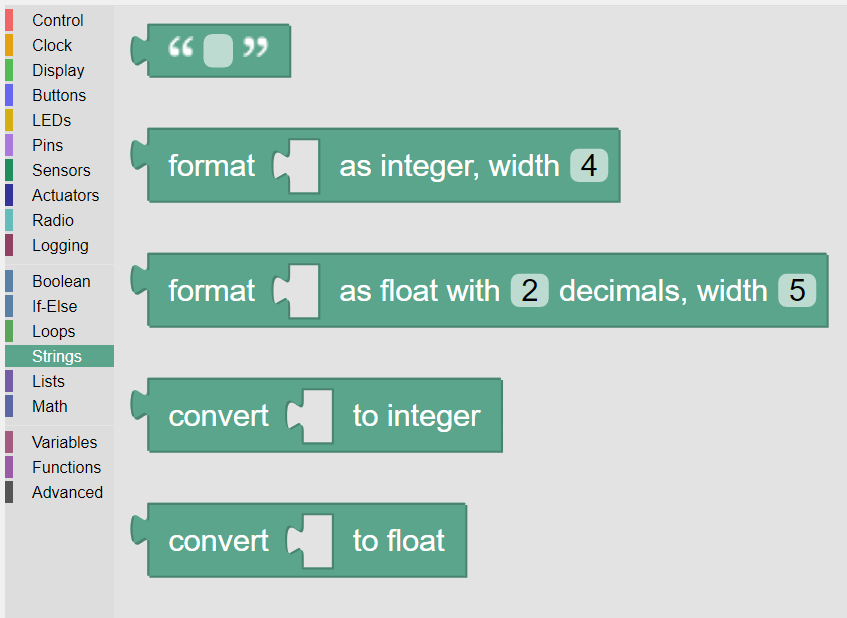

-------
Strings
-------

Strings are an array of consecutive text characters such as ``“Hello”``, or ``“this is a string”``.

The Strings Category provides a set of value blocks for specifying and formatting strings, as shown in :numref:`strpalette`.

.. _strpalette:

   
   The palette of **KookaBlockly** String blocks

Text
----

This block allows a user to type in text that can be used as a string value by other blocks.

Type in the desired text between the double-quotes ``"``, for example ``"Hello World"``.

Format as Integer
-----------------

This block takes a numerical value block and formats its result as an integer with a width as defined in the block.  

For example, the integer ``1000`` would be formatted as the character string ``“1000”``.

The results will in some cases vary:

* if the integer is wider than the specified width, the format will be enlarged to accommodate the number of characters required.
  For example, if the width is specified as ``2`` but the number is ``1000``, the output will have width of ``4`` being ``"1000"``.
* if the specified width of the output is greater than the width required, then leading spaces will be added.
  For example, if the width is specified as ``2`` but the number is 4, the output will be ``"4"``.

Format as Floating Point
------------------------

This block takes a numerical value block and formats its result as a floating point number with 
the specified number of decimal places and width (not including the decimal point).  

For example, the number 123.4567 formatted as 2 decimals with width 5, would result in the character string “123.46”.  Note that 
the last digit is rounded up if greater than or equal to 5 or down if less than 5.

The results will in some cases vary:

* if the number is wider than the specified width, the format will be enlarged to accommodate the number of characters required.
  For example, if the width is specified as ``3.2`` but the number is ``1000.12``, the output will have width of ``6.2`` being ``"1000.12"``.
* if the specified width of the output is greater than the width required, then leading spaces and trailing zeroes will be added.
  For example, if the width is specified as ``4.2`` but the number is ``3.1``, the output will be ``" 3.10"``.

Convert to Integer
------------------

This block converts an input string value and outputs a numeric integer value.

For example, an input of ``"1234"`` will output the integer number ``1234``.

Inputs strings that are not numeric integers, for example ``"ten"`` or ``"10.1"``, will raise a formatting error and the script will terminate.

Numeric inputs are permitted, for example a floating point input ``10.1`` will yield an integer output ``10``.  
Integer inputs will be passed through as integer outputs.

This block is useful when parsing text from the :doc:`radio` into integer data for use in computations.

Convert to Float
----------------

This block converts an input string value and outputs a numeric floating point value.

For example, an input of ``"1234.56"`` will output the integer number ``1234.56``.

Inputs strings that are not numeric floats, for example ``"ten point one"`` will raise a formatting error and the script will terminate.

Numeric inputs are permitted, for example an integer input ``10`` will yield an integer output ``10.0``.  
Floating point inputs will be passed through as floating point outputs.

This block is useful when parsing text from the :doc:`radio` into floating point data for use in computations.

