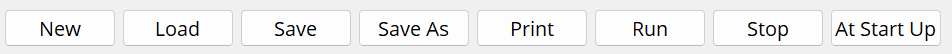
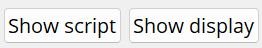
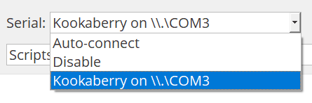
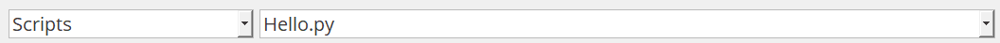
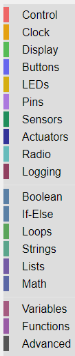
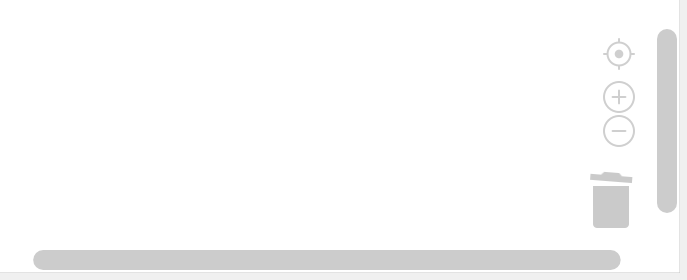

Using the KookaBlockly Application
==================================

A KookaBlockly script is assembled from graphical function blocks dragged onto the workspace from the palette of blocks on the left of the display.  The blocks click together like pieces of a jigsaw puzzle to form a series of steps that the Kookaberry microcomputer will perform.

.. figure:: images/kblockly-welcome-script.png
   :width: 80%
   :align: center
   :alt: KookaBlockly Canvas

   This is the KookaBlockly display with an example KookaBlockly script. 

The example shown above shows a loop that writes a welcome message on the Kookaberry display and flashes the Kookaberry's LEDs.  It then sleeps for 2 seconds and then goes back to the beginning of the loop.  The loop will run until the Kookaberry is reset or power is removed.

This reference guide provides a reference for using KookaBlockly and for each of the blocks in the palette of KookaBlockly block categories.

The application window has numerous controls, as are described below:

1. At the top-left of the window, a set of buttons with which KookaBlockly scripts may be created, loaded, saved, run and stopped.

+-------+-------------------------------------------------------------------------------------------------------------------+
|New    |Empty the workspace to start a new script. If the current contents have not been saved then a save prompt is given.|
+-------+-------------------------------------------------------------------------------------------------------------------+
|Load   |Load a script from a file appending it to the current script.                                                      |
+-------+-------------------------------------------------------------------------------------------------------------------+
|Save   |Save the cuurently named script to the corresponding file.                                                         |
+-------+-------------------------------------------------------------------------------------------------------------------+
|Save As|Save the current script to a new file within a selected folder.                                                    |
+-------+-------------------------------------------------------------------------------------------------------------------+
|Print  |Print the current script.                                                                                          |
+-------+-------------------------------------------------------------------------------------------------------------------+
|Run    |Transfer the current script to the tethered Kookaberry and run it on the Kookaberry.                               |
+-------+-------------------------------------------------------------------------------------------------------------------+
|Stop   |Terminate the script currently running on the Kookaberry.                                                          |
+-------+-------------------------------------------------------------------------------------------------------------------+

2. At the top-right of the window, the "Show display" button which will open a window on which the attached Kookaberry is shown in virtual form.  This includes the Kookaberry's display, LEDs, and clickable buttons.

3. Second to the top-right is the "Show script" button which opens a window in which the MicroPython script generated by the loaded KookaBlockly script is displayed.  This script cannot be edited within this window.

4. At the top-centre is the "Serial" drop-down box which shows which serial USB ports are available and which connected to a tethered Kookaberry.

5. Below the "Serial" box are two drop-down boxes.  The left one contains a list of folders in the "Kookaberry Scripts / KookaBlockly" folder.  The right box contains a list of KookaBlockly scripts within the folder selected in the left-hand box.  Together these allow the selection and loading of any pre-existing KookBlockly script in the KookaBlockly folder and sub-folders.

6. Down the left of the window is a vertically-oriented list of the KookaBlockly pallete categories. Click on any category to reveal the pallete of blocks, click on and drag the desired block to the workspace, position it and release to drop the block in place.

7. In the centre of the window is the KookaBlockly workspace.  Blocks can be dragged into this space, repositioned, resized and deleted by using the mouse or trackpad.

8. At the bottom-right of the window is a set of icons for centering the KookaBlockly script, for zooming in and out, and a Trash symbol for retrieving blocks that were deleted during the current editing session.  There are also horizontal and vertical scrollbars for positioning the KookaBlockly workspace within the window.

 