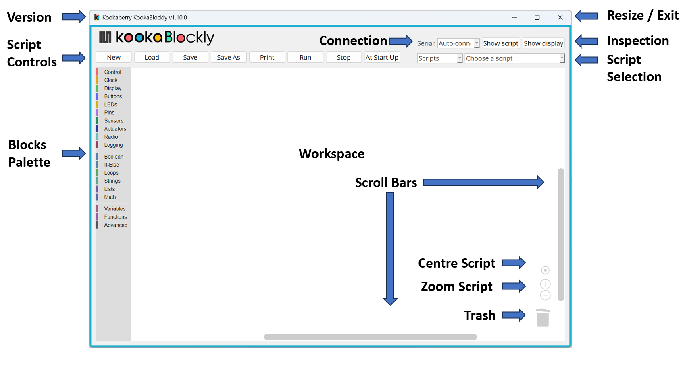

Using the KookaBlockly Application
==================================

Launching KookaBlockly on a personal computer will result in the following display.

   This is the KookaBlockly display with the controls labelled. 

The application window has numerous controls, as are described below:

Version
-------

The version of KookaBlockly is shown at the top-left of the KookaBlockly window.

Resize / Exit
-------------

These controls allow the KookaBlockly window to be minimises or maximised, and the KookBlockly application to be exited.

If the KookBlockly script has not been saved before attempting to exit KookaBlockly, a prompt dialogue will appear providing an opportunity to save or not save the current script to a file.

Resizing of the window can also be accomplished by clicking on the window edges and dragging to resize.

The appearance and location of these controls varies between Windows, MacOS and Raspbian and conforms to the conventions used by the user interface of those operating systems. 

Workspace
---------

In the centre of the window is the KookaBlockly workspace.  Blocks can be dragged into this space, repositioned, resized and deleted by using the mouse or trackpad.

Blocks Palette
--------------

Down the left of the window is a vertically-oriented list of the KookaBlockly pallete categories. 

Click on any category to reveal the pallete of blocks, click on and drag the desired block to the workspace, position it and release to drop the block in place.

   The Blocks Palette showing the Block Categories

Script Controls
---------------

At the top-left of the window, a set of buttons with which KookaBlockly scripts may be created, loaded, saved, run and stopped.

.. figure:: images/script-control-buttons.png
   :width: 500
   :align: center

   The KookaBlockly Script Control Buttons

The functions of each of the KookaBlockly Script Control buttons is:

New
  Empty the workspace to start a new script. If the current script contents have not been saved then a save prompt is given.

Load
  Load a script from a file appending it to the current script.

Save 
  Save the currently named script to the corresponding file.

Save As
  Save the current script to a new file within a selected folder.

Print
  Print the current script.

Run
  Transfer the current script to the tethered Kookaberry and run it on the Kookaberry.

Stop
  Terminate the script currently running on the Kookaberry.

Inspection Buttons
------------------

At the top-right of the window, the Inspection Buttons will open separate windows.

.. figure:: images/show-script-display-buttons.png
   :width: 250
   :align: center

   The Inspection Buttons: Show script and Show display

"Show display" 
  This button which will open a window on which the attached Kookaberry is shown in virtual form.  This includes the Kookaberry's display, LEDs, and clickable buttons.

"Show script" 
  This button opens a window in which the MicroPython script generated by the loaded KookaBlockly script is displayed.  This script cannot be edited within this window.

Connection
----------

At the top-centre is the "Serial" drop-down box which shows which serial USB ports are available and which is connected to a tethered Kookaberry.

.. figure:: images/serial-dropdown.png
   :width: 300
   :align: center

   The Serial drop-down showing the available and used USB serial connection ports

Plugging in a Kookaberry usually automatically assigns a USB serial port.

If the Kookaberry is not responding, select the Auto-connect option to reset the serial connection to the Kookaberry.

It is also possible to block a Kookaberry connection by selecting Disable from the dropdown-box.

Script Selection
----------------

   The Script Sellection dropdown boxes

"Scripts" dropdown box
  This contains a list of folders in the "Kookaberry Scripts / KookaBlockly" folder.  

"Choose a script"
  This contains a list of KookaBlockly scripts within the folder selected in the left-hand box.  Together these allow the selection and loading of any pre-existing KookBlockly script in the KookaBlockly folder and sub-folders.

Scroll Bars, Centre, Zoom and Trash
-----------------------------------

At the bottom-right of the window is a set of control icons:

.. figure:: images/workspace-zoom-trash-scrollbars.png
   :width: 400
   :align: center

   Control icons at the bottom right of the KookaBlockly window

Centre Script
  for centering the KookaBlockly script

Zoom Script
  for changing the size of the KookaBlockly script by zooming in and out

Trash
  for retrieving blocks that were deleted during the current editing session.  

Scrollbars
  there are horizontal and vertical scrollbars for positioning the KookaBlockly workspace within the window.

 