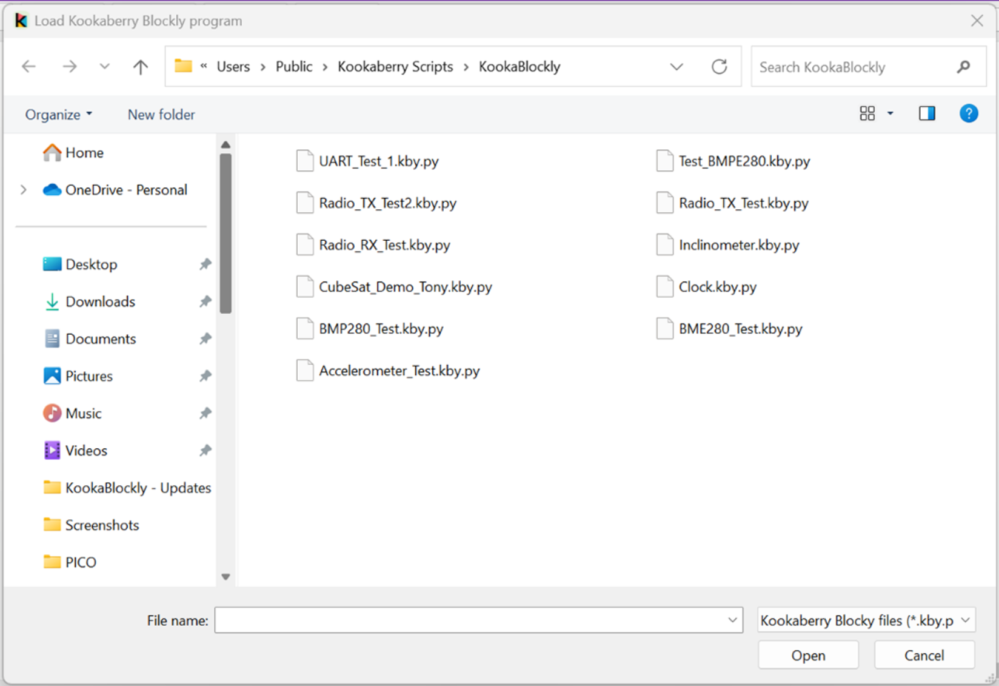

Using the KookaBlockly Application
==================================

Launching **KookaBlockly** on a personal computer will result in the following display.

.. figure:: images/kookablockly-display.png
   :width: 100%
   :align: center

   This is the **KookaBlockly** display with the controls labelled. 

The application window has numerous controls, as are described below:

Version
-------

The version of **KookaBlockly** is shown at the top-left of the **KookaBlockly** window.

.. Note::
  
   The latest version of **KookaBlockly** can be conveniently downloaded from the **Kookaberry** Github repository at https://github.com/kookaberry/kooka-releases/releases.

   See the section :doc:`installing` for instructions.

If a **KookaBlockly** script has been loaded, the path and name of the file from which the script was loaded is shown next to the **KookaBlockly** version.

Resize / Exit
-------------

These controls allow the **KookaBlockly** window to be minimises or maximised, and the KookBlockly application to be exited.

If the KookBlockly script has not been saved before attempting to exit **KookaBlockly**, a prompt dialogue will appear providing an opportunity to save or not save the current script to a file.

   Prompt dialogue on attempted exit with unsaved script. 

Resizing of the window can also be accomplished by clicking on the window edges and dragging to resize.

The appearance and location of these controls varies between Windows, MacOS and Raspbian and conforms to the conventions used by the user interface of those operating systems. 

Workspace
---------

In the centre of the window is the **KookaBlockly** workspace.  

Blocks can be dragged into this space, repositioned, resized and deleted by using the mouse or track-pad or pointing device.

Blocks Palette
--------------

Down the left of the window is a vertically-oriented list of the **KookaBlockly** palette categories. 

Click on any category to reveal the palette of blocks, click on and drag the desired block to the workspace, 
position it and release to drop the block in place.  The blocks palette will then automatically close.

To close the blocks palette without dragging a block into the workspace, either click on the palette icon used to open the palette,
or press the ``Esc`` key.

.. figure:: images/blocks-palette.png
   :width: 100
   :align: center

   The Blocks Palette showing the Block Categories

The block categories and blocks are fully described in the :doc:`part2` section.

Script Controls
---------------

At the top-left of the window, a set of buttons with which **KookaBlockly** scripts may be created, loaded, saved, run and stopped.

   The **KookaBlockly** Script Control Buttons

The functions of each of the **KookaBlockly** Script Control buttons is:

New
  Empties the workspace to start a new script. If the current script contents have not been saved then a save prompt is given.

   Prompt dialogue on attempting to clear the workspace containing an unsaved script. 

Load
  The **Load** button allows the user to select a **KookaBlockly** program to be loaded into the Workspace, appending it to the current script.  This feature enables the assembling of scripts by combining separate script files.

  Move the cursor to this button, press click on the mouse and the following file dialogue will be displayed:

   **KookaBlockly** script load file selection dialogue. 

The default directory for **Kookaberry** scripts within the current user’s account is ``/Kookaberry Scripts/KookaBlockly`` and the user can navigate away from this as desired.  

**KookaBlockly** script files have a type designation of ``.kby.py``.

Selecting a script and pressing the dialogue's **Open** button, or alternatively double-clicking on a selected **KookaBlockly** script file 
will place a copy of that script in the **KookaBlockly** Workspace from where it can be modified, saved and run on the **Kookaberry**.

.. important::
    
   When assembling scripts from a number of files, the name of the last loaded file becomes the default for saving the script.  If the script is intended to be saved into a new or differently-named file then use the **Save As** button to give a different name to the file.

Save 
  Saves the currently named script to the corresponding file. 

  If the script was loaded from a file, the path and name of the file from which the script was loaded is shown next to the **KookaBlockly** version and the script will be save to that file.

  If the script has not been previously saved, the **Save As** procedure is automatically used.

Save As
  Saves the current script to a new file within a selected folder.

  Move the cursor to this button, press click on the mouse and the following file dialogue will be displayed:

   **KookaBlockly** script save file selection dialogue. 

The default directory for **Kookaberry** scripts within the current user’s account is ``/Kookaberry Scripts/KookaBlockly`` 
and the user can navigate away from this to another folder as desired.  

**KookaBlockly** script files have a type designation of ``.kby.py``.

Enter the new file's name and press the dialogue's **Save** button will save the current script to the file.  If the file already exists, another dialogue will open asking to confirm whether the file is to be replaced.  Press **Yes** to overwrite the file, or **No** to go back and change the intended file name.

   **KookaBlockly** existing file name dialogue. 

Print
  Prints the current view of the script in the workspace, *which may not be the whole script*.  Using the **Zoom** buttons and **Scroll Bars**, adjust the view of the script to suit the printout desired.

  When the **Print** button is clicked, a Print dialogue (per the operating system convention) appears as below.

  Choose the print options, which again are specific to the PC operating system and the installed printer, and then press the **Print** button to finalise prining options and then printing to the chosen printer.  

  Print options may include paper size, paper orientation, multi-page layout, printer selection and printer setup.

   **KookaBlockly** script Print dialogue. 

Run
  Transfers the current script to the tethered **Kookaberry** and runs the script on the **Kookaberry**.

Stop
  Terminates the script currently running on the tethered **Kookaberry**.

Inspection Buttons
------------------

At the top-right of the window, the Inspection Buttons will open separate windows.

   The Inspection Buttons: Show script and Show display

Show display
  This button which will open a window on which the attached **Kookaberry** is shown in virtual form.  
  This includes the **Kookaberry**'s display, LEDs, buttons A to D and reset, and a button to start the **Kookaberry**'s internal menu.

  The display will mirror the physical display on the **Kookaberry**.

  The LEDs will change colour to mirror illumination of the real LEDs on the **Kookaberry**.

  The buttons can be clicked using a mouse or trackpad on the PC, and will respond in the same way as the physical buttons on the **Kookaberry**.

   Virtual **Kookaberry** window

.. Note::
  
   It is also possible to load **Kookaberry** firmware onto standard Pi Pico microcomputer boards.  
   These boards do not have the pyhsical **Kookaberry** display, LEDs or buttons.  
   In this case the virtual **Kookaberry** window can be used to view and operate the **Kookaberry**'s user interface.

Show script
  This button opens a window in which the MicroPython script generated by the loaded **KookaBlockly** script is displayed.  

  The size of the window showing the script can be adjusted by clicking on and dragging the edges of the script window using the cursor.

  The MicroPython is read-only and cannot be edited within this window.

  There is a check-box which when ticked will cause the script window to stay visible in front of other windows on the computer screen.

  This window presents a live view of the generated MicroPython script and it is possible to watch the MicroPython script being dynamically 
  altered as the **KookaBlockly** script is being edited.

   **KookaBlockly**-generated MicroPython script window

Connection
----------

At the top-centre is the "Serial" drop-down box which shows which serial USB ports are available and which is connected to a tethered **Kookaberry**.

.. figure:: images/serial-dropdown.png
   :width: 300
   :align: center

   The Serial drop-down showing the available and used USB serial connection ports

Plugging in a **Kookaberry** usually automatically assigns a USB serial port.

If the **Kookaberry** is not responding, select the ``Auto-connect`` option to reset the serial connection to the **Kookaberry**.

It is also possible to block a **Kookaberry** connection by selecting ``Disable`` from the dropdown-box.

Script Selection
----------------

.. figure:: images/scripts-dropdowns.png
   :width: 500
   :align: center

   The Script Sellection dropdown boxes

Scripts dropdown box
  This contains a list of folders in the ``Kookaberry Scripts/KookaBlockly`` folder.  

Choose a script
  This contains a list of **KookaBlockly** scripts within the folder selected in the left-hand box.  

Together these dropdown-boxes allow the selection and loading of any pre-existing KookBlockly script in the **KookaBlockly** folder and sub-folders.

If an unsaved **KookaBlockly** script is in the workspace, a prompt will appear giving the opportunity to save the existing script to a file before replacing it with the selected script.

   Prompt dialogue on script replacement when an unsaved script is in the workspace. 

Scroll Bars, Centre, Zoom and Trash
-----------------------------------

At the bottom-right of the window is a set of control icons:

.. figure:: images/workspace-zoom-trash-scrollbars.png
   :width: 400
   :align: center

   Control icons at the bottom right of the **KookaBlockly** window

Centre Script
  for centering the **KookaBlockly** script.
  Clicking on the Centre icon will centre the script in the Workspace and zoom it to fit the **KookaBlockly** window.

Zoom Script
  for changing the visual size of the **KookaBlockly** script by zooming in and out.

  Click on the `+` icon to zoom in and visually enlarge the script.

  Click on the `-` icon to zoom out and visually shrink the script.
  

Trash
  for retrieving blocks that were deleted during the current editing session.  

  Click on the Trash icon to open it and show the blocks that have been deleted in the current editing session.

  To retrieve a block from the Trash, click on the block and drag it back into the Workspace.

  To close the Trash press the ``Esc`` key.

  When **KookaBlockly** is closed the contents of the Trash are deleted.

Scrollbars
  there are horizontal and vertical scrollbars for positioning the **KookaBlockly** workspace within the window.  

  Click on a scrollbar and drag it up/down or left/right as appropriate to reposition the Workspace in the **KookaBlockly** window.

 