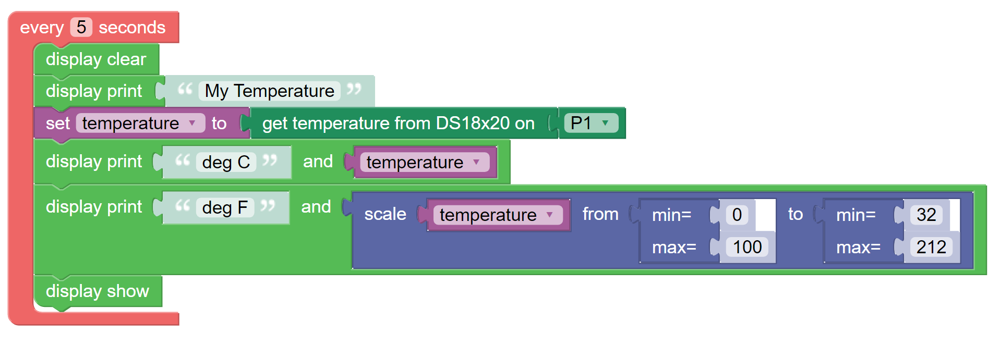

---------
Variables
---------

**Variables** are a way of creating and manipulating a named value, in the same way that algebra uses names to refer to a value.  
A **Variable** is useful as a named container to store a value for later use in one or more places in a **KookaBlockly** script.

Examples of typical **Variable** names are **X**, **Y** and **Z** when referring to cartesian coordinates; **H**, **W** and **D** as dimensions of an object; 
and **i** or **j** as an index into a **List**.  **Variable** names can of course be longer, for example **height**, or **temperature**

When **KookaBlockly** is first started, or when a new script is started, the **Variables** palette looks like this :numref:`varpalette`.

.. _varpalette:

   
   The initial **Variables** palette

Create Variable
---------------

Clicking on “Create variable”  brings up a dialogue box, shown in :numref:`varcreatedialg`, where the user can define the **Variable**'s name.  
Type in a name and then click on **OK**.  The figure shows an example name ``"my_variable"``.

.. _varcreatedialg:

   Creating a **Variable** named my_variable

Once a new **Variable** has been created, the new **Variable** will be available in the **Variables** palette.

It is possible to right-click while hovering over the **Variable** block in the palette to reveal a number of actions 
which can be selected by then clicking on them:

1. **Delete the variable** - removes the **Variable**, and its associated blocks if it was the only **Variable**.
2. **Rename the variable** - brings up a dialogue box, as for creating a **Variable**, in which the new name can be typed.  
   The new name must contain at least one visible character and not be the same as any other **Variable**.
3. **Help** - this option does not yet work. It is intended eventually to display Help text.

.. image:: images/variables-right-click.png
   :height: 300
   :align: center

Set Variable
------------

Using this block, a value can be assigned to a **Variable** by attaching a value block to its input.  
The value can be a number, a boolean, or a character string.

The **Variable** to be assigned the value can be selected from the drop-down-list.

The drop-down list also has some other choices:

1. **Rename variable** - brings up a dialogue box in which the new name can be typed.  
   The new name must comprise at least one visible character and must not be a duplicate name.
2. **Delete the variable** - removes the **Variable** and its associated blocks from the script.

Change Variable
---------------

This action block allows the user to change the selected **Variable** by a number specified by the input numerical value.

This block will only work for numerical variables and will only accept numerical values.  
Character strings and boolean values will not be accepted.

The example in :numref:`varchangeexample` illustrates how this block may be used as a counter.
Three variables are set up: ``count_b``, ``count_c`` and ``count_d`` to count the number of times buttons B, C and D are pressed.
The running totals are printed on the **Kookaberry**'s display, as shown in :numref:`varchangedisplay`.

.. _varchangeexample:

   Example script counts button presses

 
.. _varchangedisplay:

   The Kookaberry display resulting from :numref:`varchangeexample`

Variable Value
--------------

This value block allows a user to attach a variable’s value to the input of another block.

The example in :numref:`varvalexample` reads a temperature from a sensor once per 5 seconds, storing it in a **Variable** named ``"temperature"``, then using the stored value to perform a conversion calculation 
and display the original and converted values on the **Kookaberry** display:

.. _varvalexample:

   Example script reads converts temperature readings to Fahrenheit

